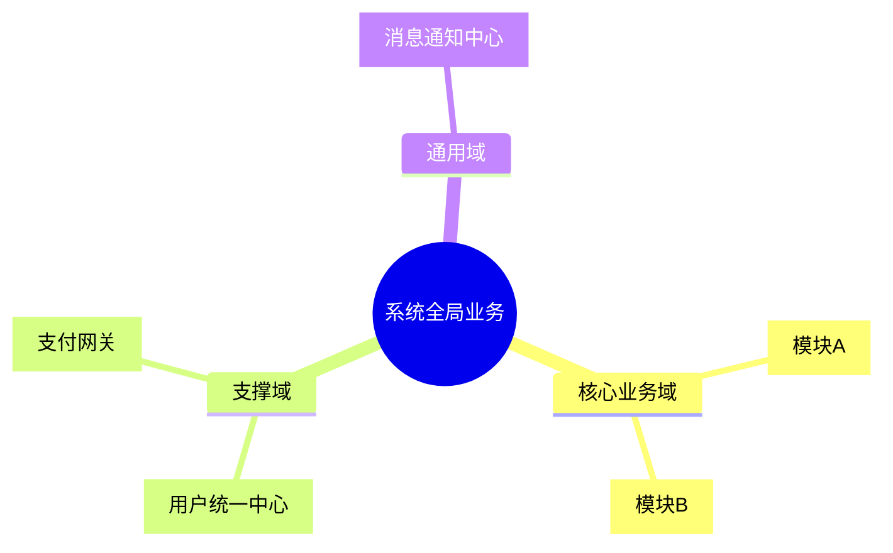
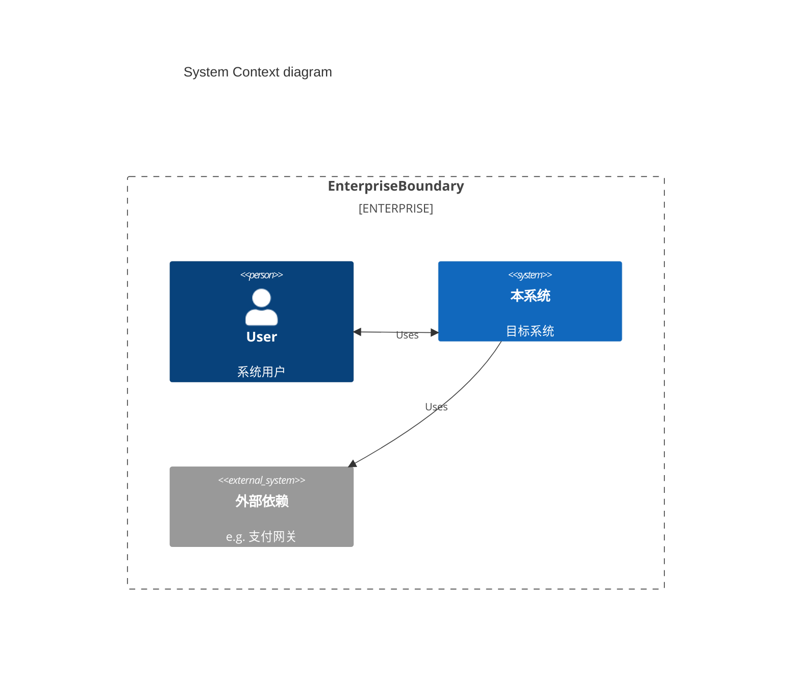

# 系统架构设计 (System Architecture)

> 版本: v1.0.0 | 最后更新: {Timestamp} | 责任人: [待补充]

## 1. 全局业务架构图 (Business Architecture)
> 💡 **指引**: 在这里放置能够总览全部业务功能的全局业务板块图，帮助非技术人员或新同学快速理解系统到底包含哪些业务能力矩阵（如：引流层 -> 核心业务层 -> 支撑域层）。

## 2. C4 系统上下文图 (System Context)
> 描述本系统在企业IT架构中的位置。

## 3. 部署与物理拓扑 (Deployment Architecture)
> 💡 **指引**: 描述系统物理层面的部署结构，展示容器、网关、数据库、缓存节点以及外部网络的边界。

(请在此处补充部署架构图，可使用 Mermaid / Draw.io 链接 / 图片)

## 4. 关键架构决策 (ADR Summary)

> 记录"为什么这么做"，避免后来者重复踩坑。

| ID | 决策项 | 决策结论 | 背景/原因 |
| --- | --- | --- | --- |
| ADR-001 | 基础框架 | Spring Boot 3 | 拥抱云原生，JDK 17 长期支持 |

## 5. 技术/业务债务 (Tech & Business Debt)

* **逻辑债**: (待补充，如某个业务流程使用了临时妥协的硬编码)
* **代码债**: (待补充，如某个类的圈复杂度极高，急需重构)
