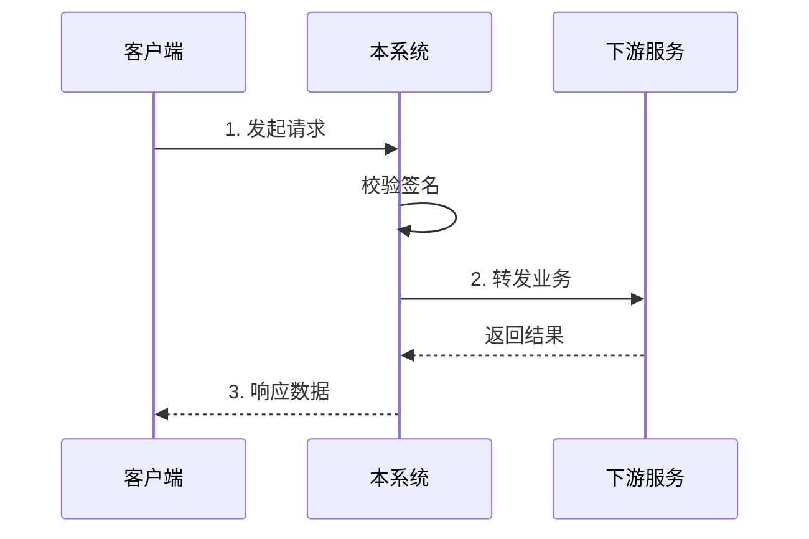

# 业务接入指南 (Integration Guide)

> 版本: v1.0.0 | 最后更新: {Timestamp} | 责任人: [待补充]

## 0. 概述 (Overview)
- 描述业务逻辑
- 相关接口
- 准备工作

## 1. 接入环境 (Environments)
> 💡 联调前请先申请对应环境的网关凭证。

| 环境 | 网关地址 | 备注 |
| --- | --- | --- |
| 测试 (TEST) | `http://test-gateway.example.com` | 不稳定，供日常对接 |
| 预发 (UAT) | `https://uat-gateway.example.com` | 连生产只读库，需加白名单 |
| 生产 (PROD) | `https://gateway.example.com` | 正式上线 |

## 2. 鉴权与加解密 (Authentication & Security)
> 💡 所有接口请求均需在 Header 中携带此鉴权信息。

* **鉴权方式**: (e.g. `Oauth2` / `AK/SK 验签` / `Token`)
* **签名算法**: (待补充，如 `HMAC-SHA256`)
* **Header 参数示例**:
    * `X-App-Id: {your_app_id}`
    * `X-Signature: {calculated_sign}`

## 3. 交互时序图 (Interaction Flow)
> 描述调用方应该如何与本系统交互。

## 4. 核心业务流程

### 4.1 状态机流转

(请在此处补充状态流转图)

## 5. 常见错误码处理 (FAQ)

| 错误码 | 含义 | 建议处理方式 |
| --- | --- | --- |
| `20001` | 余额不足 | 提示用户充值，不要重试 |
| `50009` | 频率限制 | 触发限流，请并在 5s 后重试 |
