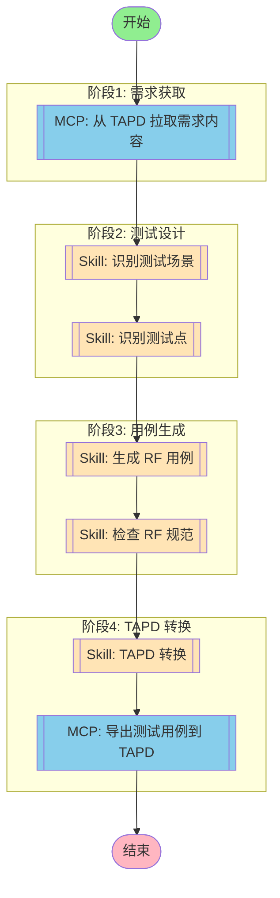

# 完整测试工作流



## 工作流说明

### 执行流程

1. **需求获取** - 从 TAPD 拉取需求内容
2. **测试设计** - 识别测试场景和测试点
3. **用例生成** - 生成符合 RF 规范的测试用例
4. **规范检查** - 检查生成的用例是否符合编写规范
5. **TAPD 转换** - 将 RF 用例转换为 TAPD 格式
6. **导出上传** - 将测试用例导出并上传到 TAPD

### 执行方式

#### MCP 节点

**mcp_fetch(MCP: 从 TAPD 拉取需求内容)**

- **MCP Server**: tapd
- **功能**: 根据需求 URL 拉取需求内容
- **输入**: 需求链接
- **输出**: 需求详情（ID、标题、内容、验收标准）

**mcp_export(MCP: 导出测试用例到 TAPD)**

- **MCP Server**: tapd
- **功能**: 将测试用例导出到 TAPD
- **输入**: Excel 文件或 Base64 编码
- **输出**: 导入结果

#### Skill 节点

**skill_scenario(Skill: 识别测试场景)**

- **Skill**: rf-test
- **功能**: 从需求内容中识别测试场景
- **输出**: 场景列表

**skill_points(Skill: 识别测试点)**

- **Skill**: rf-test
- **功能**: 基于场景识别具体测试点
- **输出**: 测试点列表

**skill_generation(Skill: 生成 RF 用例)**

- **Skill**: rf-test
- **功能**: 基于测试点生成 RF 用例
- **输出**: .robot 文件

**skill_validation(Skill: 检查 RF 规范)**

- **Skill**: rf-standards-check
- **功能**: 检查 RF 用例是否符合规范
- **输出**: 规范检查报告

**skill_conversion(Skill: TAPD 转换)**

- **Skill**: rf-tapd-conversion
- **功能**: 将 RF 用例转换为 TAPD 格式
- **输出**: Excel 文件和 Base64 编码

### 触发方式

```bash
# 通过 CLI 触发
/rf-test

# 通过 Agent 调用
execute_workflow("full-test-pipeline")
```

### 配置参数

```json
{
  "tapd_workspace_id": "48200023",
  "output_dir": "./output",
  "creator": "测试工程师",
  "test_case_priority": "P0,P1,P2"
}
```