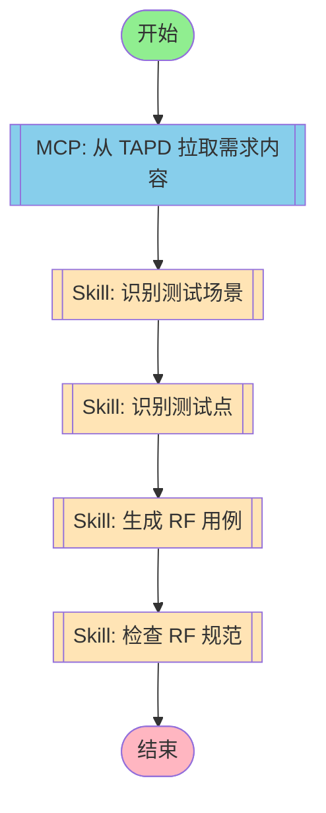

# 需求转用例工作流



## 工作流说明

### 执行流程

1. **需求获取** - 从 TAPD 拉取需求内容
2. **场景识别** - 识别测试场景
3. **测试点识别** - 识别具体测试点
4. **用例生成** - 生成 RF 测试用例
5. **规范检查** - 检查用例规范

### 触发方式

```bash
# 通过 CLI 触发
/rf-requirement-to-testcase

# 通过 Agent 调用
execute_workflow("requirement-to-rf")
```

### 输入参数

| 参数 | 说明 | 必填 |
|------|------|------|
| requirement_url | TAPD 需求链接 | 是 |
| output_dir | 输出目录 | 否，默认为 ./output |
| creator | 创建人名称 | 否，默认为当前用户 |

### 输出结果

- RF 用例文件（.robot）
- 规范检查报告
- 用例统计信息