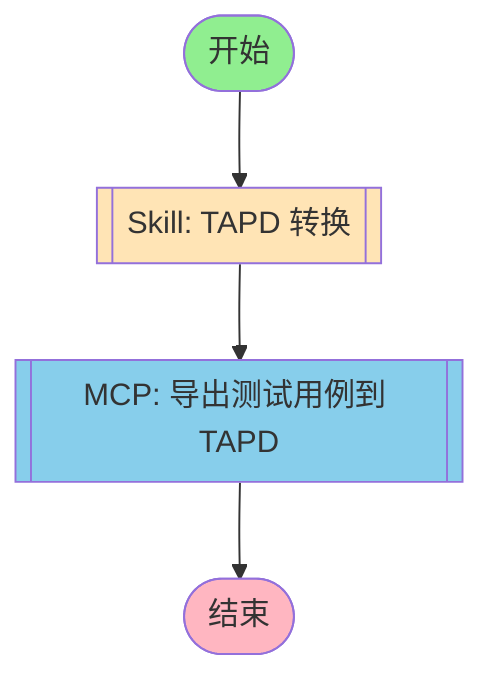

# RF 转 TAPD 工作流



## 工作流说明

### 执行流程

1. **TAPD 转换** - 将 RF 用例转换为 TAPD Excel 格式
2. **导出上传** - 将转换结果导出并上传到 TAPD

### 触发方式

```bash
# 通过 CLI 触发
/rf-to-tapd

# 通过 Agent 调用
execute_workflow("rf-to-tapd")
```

### 输入参数

| 参数 | 说明 | 必填 |
|------|------|------|
| robot_file | RF 用例文件路径 | 是 |
| output_excel | 输出 Excel 路径 | 否，默认为原文件名.xlsx |
| creator | 创建人名称 | 否，默认为当前用户 |

### 输出结果

- TAPD Excel 文件
- Base64 编码文件
- 用例数量统计
- 导出结果

### 批量转换

```bash
# 批量转换整个目录
python 03-scripts/batch_convert.sh ./cases ./output "测试工程师"
```