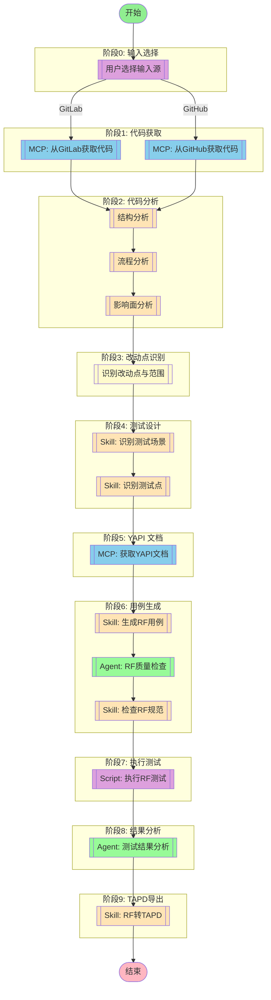

## 工作流说明

### 输入源选择

用户可以选择以下输入方式：
1. **GitLab代码**：从GitLab获取代码变更
2. **GitHub代码**：从GitHub获取代码变更

### 代码分析流程

使用 analyze 指令进行完整分析：
1. **结构分析**：技术栈→实体ER图→接口入口
2. **流程分析**：调用链→时序→复杂逻辑
3. **影响面分析**：依赖引用→数据影响→风险评估

### 改动点识别

基于代码分析结果，识别：
- 改动的文件和模块
- 新增/修改的接口
- 影响的业务流程
- 需要补充的测试点

### 执行流程

1. **代码获取** - 从GitLab/GitHub获取指定分支或commit的代码
2. **代码分析** - 使用analyze指令进行完整分析
3. **改动点识别** - 识别改动点和测试范围
4. **测试设计** - 识别测试场景和测试点
5. **接口文档** - 从YAPI获取接口文档（如有）
6. **用例生成** - 生成符合RF规范的测试用例
7. **质量保证** - RF质量保证Agent检查用例质量
8. **规范检查** - 检查生成的用例是否符合编写规范
9. **执行测试** - 执行RF测试用例并验证
10. **结果分析** - 测试结果分析Agent分析质量指标
11. **TAPD导出** - 将RF用例转换为TAPD格式

## 节点定义

### input_source（输入源选择）

- **描述**：用户选择输入源（GitLab 或 GitHub）
- **交互**：询问用户"从 GitLab 还是 GitHub 获取代码？"
- **分支**：
  - GitLab 分支 → `mcp_gitlab_fetch` 节点
  - GitHub 分支 → `mcp_github_fetch` 节点

### mcp_gitlab_fetch（GitLab 代码获取）

- **MCP 服务器**: gitlab
- **用户意图**：
```
从 GitLab 获取指定仓库的代码。
用户可选择指定分支（如 develop、master）或指定 commit。
获取代码后用于分析改动点。
```
- **参数**：
  - `project_path`: GitLab 项目路径（如 `group/project`）
  - `branch_or_commit`: 分支名或 commit SHA
  - `output_dir`: 代码输出目录（临时）

### mcp_github_fetch（GitHub 代码获取）

- **MCP 服务器**: github
- **用户意图**：
```
从 GitHub 获取指定仓库的代码。
用户可选择指定分支（如 main、master）或指定 commit。
获取代码后用于分析改动点。
```
- **参数**：
  - `owner`: 仓库所有者
  - `repo`: 仓库名称
  - `branch_or_commit`: 分支名或 commit SHA
  - `output_dir`: 代码输出目录（临时）

### code_analysis（代码分析）

- **描述**：使用对标项目的 analyze 指令进行完整代码分析
- **执行方法**：
  1. 结构分析（3步）：技术栈→实体ER图→接口入口
  2. 流程分析（3步）：调用链→时序→复杂逻辑
  3. 影响面分析（3步）：依赖引用→数据影响→风险评估
- **输出**：完整代码分析报告

### change_detection（改动点识别）

- **描述**：基于代码分析结果，识别改动点和测试范围
- **输出**：改动点列表、测试范围建议

### mcp_yapi_fetch（YAPI 文档获取）

- **MCP 服务器**: yapi-auto-mcp
- **用户意图**：
```
从 YAPI 获取接口文档，用于辅助生成 RF 测试用例。
根据代码分析中识别的接口，获取对应的接口定义。
```
- **参数**：
  - `project_id`: YAPI 项目ID
  - `interface_path`: 接口路径（可选）

### skill_scenario_identification（测试场景识别）

- **Skill**: test
- **描述**：识别测试场景
- **输入**：代码分析结果、改动点列表
- **输出**：测试场景列表

### skill_test_point_analysis（测试点分析）

- **Skill**: test
- **描述**：分析测试点
- **输入**：测试场景、接口文档
- **输出**：测试点列表

### skill_rf_generation（RF 用例生成）

- **Skill**: test
- **描述**：生成 RF 测试用例
- **输入**：测试点、接口文档
- **输出**：RF 测试用例文件

### agent_rf_qa（RF 质量检查）

- **Agent**: testing-rf-quality-assurance
- **描述**：检查 RF 用例质量
- **输入**：RF 测试用例
- **输出**：质量检查报告

### skill_rf_validation（RF 规范检查）

- **Skill**: rf-standards-check
- **描述**：检查 RF 用例是否符合编写规范
- **输入**：RF 测试用例
- **输出**：规范检查报告

### script_rf_execute（RF 测试执行）

- **Script**: robot
- **描述**：执行 RF 测试用例
- **输入**：RF 测试用例文件
- **输出**：测试结果（output.xml、report.html、log.html）

### agent_results_analysis（结果分析）

- **Agent**: testing-results-analyzer
- **描述**：分析测试结果
- **输入**：测试结果
- **输出**：分析报告

### skill_tapd_conversion（TAPD 转换）

- **Skill**: tapd-conversion
- **描述**：将 RF 用例转换为 TAPD 格式
- **输入**：RF 测试用例
- **输出**：TAPD 测试用例

## 环境要求

- `GITLAB_API_URL` - GitLab API 地址（可选）
- `GITLAB_PERSONAL_ACCESS_TOKEN` - GitLab 访问令牌（可选）
- `GITHUB_TOKEN` - GitHub 访问令牌（可选）
- `YAPI_BASE_URL` - YAPI 服务器地址（可选）
- `YAPI_TOKEN` - YAPI 访问令牌（可选，格式：`projectId:token`）
- `TAPD_ACCESS_TOKEN` - TAPD 访问令牌（TAPD导出时需要）
