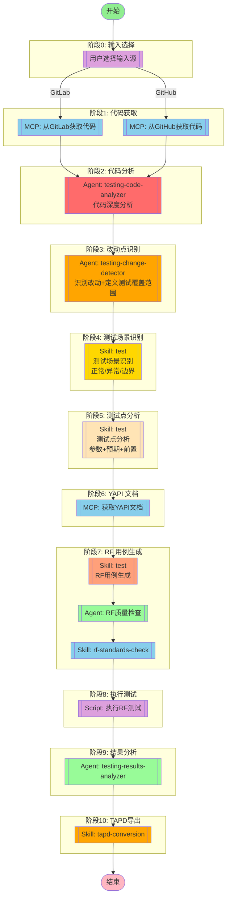

## 工作流说明

### 职责清晰划分

本工作流采用**分层职责划分**，每个节点专注于特定职责，避免混淆：

| 节点 | Agent/Skill | 核心职责 | 输入 | 输出 | 指令参考 |
|------|-------------|---------|------|------|---------|
| 阶段2 | testing-code-analyzer | 代码深度分析 | 代码 | 代码分析报告 | analyze指令 |
| 阶段3 | testing-change-detector | 改动点识别+测试覆盖范围 | 代码分析报告 | 改动点清单+测试覆盖范围 | - |
| 阶段4 | test (场景识别) | 测试场景识别 | 改动点清单 | 测试场景列表 | scenario-identification-instructions |
| 阶段5 | test (测试点分析) | 测试点分析 | 测试场景+YAPI文档 | 测试点清单 | (隐含在test中) |
| 阶段7 | test (用例生成) | RF用例生成 | 测试点清单 | RF用例文件 | script-generation-instructions |

### 关键原则

1. **改动点识别**：明确"需要测试什么范围"
   - 识别代码改动（新增/修改/删除）
   - 分析影响范围
   - 定义测试覆盖区域（需要测试的模块和区域）
   - 定义回归测试模块（需要回归的功能模块）
   - **不涉及**：具体测试场景、测试点、RF用例、测试步骤

2. **测试场景识别**：抽象"测试什么场景"
   - 从改动点中抽象业务测试场景
   - 区分正向/反向/边界/异常场景
   - 建立场景与代码的映射
   - **不涉及**：具体测试点、测试步骤、RF关键字

3. **测试点分析**：提取"如何测试"的要点
   - 基于测试场景提取测试点
   - 设计测试步骤
   - 选择RF关键字
   - **不涉及**：代码分析、改动识别

4. **RF用例生成**：生成RF脚本
   - 基于测试点生成RF用例
   - 遵循RF规范
   - 生成完整的测试套件

### 输入源选择

用户可以选择以下输入方式：
1. **GitLab代码**：从GitLab获取代码变更
2. **GitHub代码**：从GitHub获取代码变更

### 执行流程

1. **代码获取** - 从GitLab/GitHub获取指定分支或commit的代码
2. **代码分析** - Agent使用analyze指令进行完整分析（结构/流程/影响面）
3. **改动点识别** - Agent识别改动点并定义测试覆盖范围
4. **测试场景识别** - Skill从改动点抽象测试场景（正常/异常/边界）
5. **测试点分析** - Skill基于场景和YAPI文档提取测试点
6. **接口文档** - 从YAPI获取接口文档（如有）
7. **RF用例生成** - Skill生成符合RF规范的测试用例
8. **质量保证** - Agent检查用例质量
9. **规范检查** - Skill检查生成的用例是否符合编写规范
10. **执行测试** - 执行RF测试用例并验证
11. **结果分析** - Agent分析质量指标
12. **TAPD导出** - 将RF用例转换为TAPD格式

## 节点定义

### input_source（输入源选择）

- **描述**：用户选择输入源（GitLab 或 GitHub）
- **交互**：询问用户"从 GitLab 还是 GitHub 获取代码？"
- **分支**：
  - GitLab 分支 → `mcp_gitlab_fetch` 节点
  - GitHub 分支 → `mcp_github_fetch` 节点

### mcp_gitlab_fetch（GitLab 代码获取）

- **MCP 服务器**: gitlab
- **用户意图**：
```
从 GitLab 获取指定仓库的代码。
用户可选择指定分支（如 develop、master）或指定 commit。
获取代码后用于分析改动点。
```
- **参数**：
  - `project_path`: GitLab 项目路径（如 `group/project`）
  - `branch_or_commit`: 分支名或 commit SHA
  - `output_dir`: 代码输出目录（临时）

### mcp_github_fetch（GitHub 代码获取）

- **MCP 服务器**: github
- **用户意图**：
```
从 GitHub 获取指定仓库的代码。
用户可选择指定分支（如 main、master）或指定 commit。
获取代码后用于分析改动点。
```
- **参数**：
  - `owner`: 仓库所有者
  - `repo`: 仓库名称
  - `branch_or_commit`: 分支名或 commit SHA
  - `output_dir`: 代码输出目录（临时）

### agent_code_analyzer（代码分析）

- **Agent**: testing-code-analyzer
- **职责**: 使用 analyze 指令进行完整代码分析（9步骤）
- **执行方法**：
  1. 结构分析（3步）：技术栈→实体ER图→接口入口
  2. 流程分析（3步）：调用链→时序→复杂逻辑
  3. 影响面分析（3步）：依赖引用→数据影响→风险评估
- **输入**: 从 GitLab/GitHub 获取的代码路径
- **输出**: 完整代码分析报告（结构分析、流程分析、影响面分析）
- **参考指令**:
  - `00-JL-Skills/jl-skills/instructions/analyze/structure-analysis-instructions.md`
  - `00-JL-Skills/jl-skills/instructions/analyze/flow-analysis-instructions.md`
  - `00-JL-Skills/jl-skills/instructions/analyze/impact-analysis-instructions.md`

### agent_change_detect（改动点识别）

- **Agent**: testing-change-detector
- **职责**: 基于代码分析结果识别改动点和测试覆盖范围
- **执行步骤**：
  1. **改动点识别**: 对比基线版本和目标版本，识别新增/修改/删除的代码
  2. **影响面分析**: 分析改动点的依赖关系，识别受影响的调用方和数据流
  3. **测试覆盖范围定义**: 针对每个改动点定义测试覆盖区域（新增/修改/回归区域）
  4. **回归测试模块确定**: 基于影响面确定回归模块，输出回归模块清单
- **输入**: 代码分析报告（来自 testing-code-analyzer）
- **输出**:
  - 改动点清单（新增/修改/删除的代码位置和类型）
  - 影响面分析（接口变更影响、数据模型变更影响）
  - **测试覆盖范围（需要测试的模块和区域）
  - **回归测试模块清单（需要回归的功能模块）
  - 风险评估（风险等级、缓解措施）
- **职责边界**:
  - ✅ 输出改动点清单（技术层面）
  - ✅ 输出测试覆盖范围（模块层面）
  - ✅ 输出回归测试模块（功能层面）
  - ❌ 不输出具体测试场景（业务层面）
  - ❌ 不输出具体测试点（测试层面）
  - ❌ 不输出测试步骤或RF用例

### skill_scenario（测试场景识别）

- **Skill**: test (测试场景识别阶段)
- **职责**: 从改动点识别报告中抽象测试场景
- **参考指令**: `00-JL-Skills/jl-skills/instructions/test/scenario-identification-instructions.md`
- **执行步骤**:
  1. **正常流程**: 识别主流程成功路径（P0）
  2. **异常流程**: 识别业务异常、系统异常、补偿回滚（P1）
  3. **边界测试**: 识别输入边界、业务边界（P1）
  4. **并发与幂等**: 识别并发、幂等处理（P2）
- **输入**: 改动点识别报告（来自 testing-change-detector）
- **输出**:
  - 测试场景列表（场景名、类型、优先级、描述）
  - 场景分类（正常/异常/边界/并发）
- **职责边界**:
  - ✅ 输出测试场景列表（业务层面）
  - ✅ 场景使用业务语言描述
  - ❌ 不输出具体测试点
  - ❌ 不输出测试步骤或RF关键字

### skill_points（测试点分析）

- **Skill**: test (测试点分析阶段)
- **职责**: 基于测试场景和 YAPI 文档提取测试点
- **执行步骤**:
  1. **测试点提取**: 基于测试场景提取具体的测试点
  2. **参数设计**: 设计输入参数组合
  3. **预期结果**: 定义预期输出结果
  4. **前置条件**: 定义前置条件和后置清理
- **输入**: 测试场景（来自 skill_scenario）、YAPI 文档（如可用）
- **输出**:
  - 测试点清单（前置条件、输入数据、预期结果、关联接口）
- **职责边界**:
  - ✅ 输出测试点清单（测试层面）
  - ✅ 设计测试步骤
  - ✅ 选择RF关键字
  - ❌ 不涉及代码分析或改动识别

### mcp_yapi_fetch（YAPI 文档获取）

- **MCP 服务器**: yapi-auto-mcp
- **用户意图**：
```
从 YAPI 获取接口文档，用于辅助生成 RF 测试用例。
根据测试场景中识别的接口，获取对应的接口定义。
```
- **参数**：
  - `project_id`: YAPI 项目ID
  - `interface_path`: 接口路径（可选）

### skill_generation（RF 用例生成）

- **Skill**: test (RF用例生成阶段)
- **职责**: 基于测试点生成 Robot Framework 测试用例
- **参考指令**:
  - `00-JL-Skills/jl-skills/instructions/test/script-generation-instructions.md`
- **参考模板**:
  - `00-JL-Skills/jl-skills/templates/JL-Template-Scenario-Test-Case.md`
- **参考规范**:
  - `01-RF-Skills/skills/test/SKILL.md` (RF测试工作流规范)
- **执行步骤**:
  1. **目录结构**: 创建标准目录结构（Settings/Keywords/Variables/TestCases）
  2. **用例命名**: 遵循命名规范（业务操作_具体场景）
  3. **用例编写**: 生成三段式格式的测试用例
  4. **规范检查**: 遵循变量和关键字命名规范
- **输入**: 测试点（来自 skill_points）
- **输出**: RF 测试用例文件

### agent_rf_qa（RF 质量检查）

- **Agent**: testing-rf-quality-assurance
- **描述**: 检查 RF 用例质量
- **输入**: RF 测试用例
- **输出**: 质量检查报告

### skill_validation（RF 规范检查）

- **Skill**: rf-standards-check
- **描述**: 检查 RF 用例是否符合编写规范
- **输入**: RF 测试用例
- **输出**: 规范检查报告

### script_rf_execute（RF 测试执行）

- **Script**: robot
- **描述**: 执行 RF 测试用例
- **输入**: RF 测试用例文件
- **输出**: 测试结果（output.xml、report.html、log.html）

### agent_results_analysis（结果分析）

- **Agent**: testing-results-analyzer
- **描述**: 分析测试结果
- **输入**: 测试结果
- **输出**: 分析报告

### skill_conversion（TAPD 转换）

- **Skill**: tapd-conversion
- **描述**: 将 RF 用例转换为 TAPD 格式
- **输入**: RF 测试用例
- **输出**: TAPD 测试用例

## 环境要求

- `GITLAB_API_URL` - GitLab API 地址（可选）
- `GITLAB_PERSONAL_ACCESS_TOKEN` - GitLab 访问令牌（可选）
- `GITHUB_TOKEN` - GitHub 访问令牌（可选）
- `YAPI_BASE_URL` - YAPI 服务器地址（可选）
- `YAPI_TOKEN` - YAPI 访问令牌（可选，格式：`projectId:token`）
- `TAPD_ACCESS_TOKEN` - TAPD 访问令牌（TAPD导出时需要）

## 职责边界总结

| 阶段 | 职责 | 输入 | 输出 | 下一阶段 |
|------|------|------|------|---------|
| 阶段2: 代码分析 | 代码深度分析（结构/流程/影响面） | 代码 | 代码分析报告 | 阶段3 |
| 阶段3: 改动点识别 | 识别改动点，定义测试覆盖范围 | 代码分析报告 | 改动点清单+测试覆盖范围+回归模块 | 阶段4 |
| 阶段4: 测试场景识别 | 从改动点抽象测试场景（正常/异常/边界） | 改动点清单 | 测试场景列表 | 阶段5 |
| 阶段5: 测试点分析 | 基于场景提取测试点（参数+预期+前置） | 测试场景+YAPI文档 | 测试点清单 | 阶段6 |
| 阶段6: YAPI文档 | 获取接口文档 | 测试场景 | YAPI接口文档 | 阶段7 |
| 阶段7: RF用例生成 | 生成RF用例（目录+命名+三段式） | 测试点+YAPI文档 | RF用例文件 | 阶段8 |

## 注意事项

1. **testing-change-detector** 的核心输出是**技术层面的改动点**和**模块层面的测试覆盖范围**，不应涉及业务层面的测试场景
2. **test Skill** 在不同阶段有不同职责：
   - 阶段4: 场景识别（参考 scenario-identification-instructions.md）
   - 阶段5: 测试点分析
   - 阶段7: RF用例生成（参考 script-generation-instructions.md）
3. 阶段4和阶段5都使用 `test` Skill，但调用的是不同的指令/子流程
4. RF用例命名必须遵循规范：`业务操作_具体场景`，使用下划线分隔