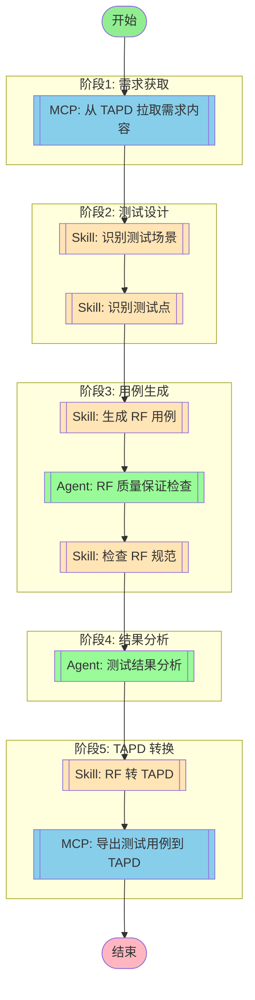

## 工作流执行指南

### MCP 工具节点

#### mcp_fetch(MCP 自动选择) - AI 工具选择模式

<!-- MCP_NODE_METADATA: {"mode":"aiToolSelection","serverId":"tapd","userIntent":"开始流程后不要理解工作，而是等待用户输入需求链接。\n不需要询问用户使用什么方式传达tapd需求，直接索取链接，不要让用户进行选择。\n根据链接查询对应的需求内容并拉取。workspace_id = 48200023，请注意解析出对应的服务名和需求id."} -->

**MCP 服务器**: tapd

**验证状态**: 有效

**用户意图（自然语言任务描述）**:

```
开始流程后不要理解工作，而是等待用户输入需求链接。
不需要询问用户使用什么方式传达tapd需求，直接索取链接，不要让用户进行选择。
根据链接查询对应的需求内容并拉取。workspace_id = 48200023，请注意解析出对应的服务名和需求id.
```

**执行方法**:

Claude Code 应分析上述任务描述，在运行时查询 MCP 服务器 "tapd" 获取当前工具列表。然后，选择最合适的工具，并根据任务要求确定适当的参数值。

#### mcp_export(MCP 自动选择) - AI 工具选择模式

<!-- MCP_NODE_METADATA: {"mode":"aiToolSelection","serverId":"tapd","userIntent":"将生成的测试用例转换为 TAPD 格式，并导出到 TAPD 平台。"} -->

**MCP 服务器**: tapd

**验证状态**: 有效

**用户意图（自然语言任务描述）**:

```
将生成的测试用例转换为 TAPD 格式，并导出到 TAPD 平台。
```

**执行方法**:

Claude Code 应分析上述任务描述，在运行时查询 MCP 服务器 "tapd" 获取当前工具列表。然后，选择最合适的工具，并根据任务要求确定适当的参数值。

### 技能节点

#### skill_scenario(识别测试场景)

- **提示**: skill "rf-test" "根据需求内容，识别测试场景"

#### skill_points(识别测试点)

- **提示**: skill "rf-test" "根据测试场景，识别具体测试点"

#### skill_generation(生成 RF 用例)

- **提示**: skill "rf-test" "根据测试点生成 RF 测试用例"

#### skill_validation(检查 RF 规范)

- **提示**: skill "rf-standards-check"

#### skill_conversion(RF 转 TAPD)

- **提示**: skill "rf-tapd-conversion"

### Agent 节点

#### agent_rf_qa(RF 质量保证检查)

- **Agent**: testing-rf-quality-assurance
- **职责**: 验证生成的 RF 用例是否符合 JL 企业标准和最佳实践
- **检查项**:
  - 变量命名（蛇形命名法：${变量名}）
  - 关键字命名（驼峰命名法：关键字名）
  - 文档格式（三段式格式：概述-前置条件-预期结果）
  - Tag 使用（优先级、评审状态）
  - JSONPath 表达式正确性

#### agent_results(测试结果分析)

- **Agent**: Test Results Analyzer
- **职责**: 分析 RF 测试执行结果，识别失败模式、趋势和系统性质量问题
- **输出**: 质量报告和改进建议

## 工作流说明

### 执行流程

1. **需求获取** - 从 TAPD 拉取需求内容
2. **测试设计** - 识别测试场景和测试点
3. **用例生成** - 生成符合 RF 规范的测试用例
4. **质量保证** - RF 质量保证 Agent 检查用例质量
5. **规范检查** - 检查生成的用例是否符合编写规范
6. **结果分析** - 测试结果分析 Agent 分析质量指标
7. **TAPD 转换** - 将 RF 用例转换为 TAPD 格式
8. **导出上传** - 将测试用例导出并上传到 TAPD

### 配置参数

```json
{
  "tapd_workspace_id": "48200023",
  "output_dir": "./output",
  "creator": "测试工程师",
  "test_case_priority": "P0,P1,P2"
}
```

### 输出结果

- RF 用例文件（.robot）
- 质量保证报告
- 规范检查报告
- 测试结果分析报告
- TAPD Excel 文件
- 导出结果统计