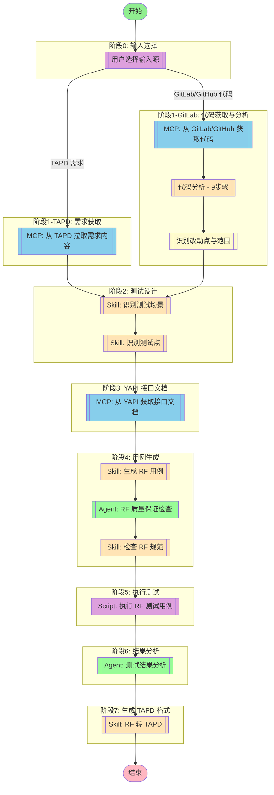

## 工作流执行指南

### 输入源选择

工作流支持两种输入模式启动：

1. **TAPD 需求模式** - 从 TAPD 拉取需求内容进行分析
2. **GitLab/GitHub 代码模式** - 从代码仓库获取代码变更进行分析

**选择逻辑**：
- 如果用户提供 TAPD 需求链接 → 走 TAPD 分支
- 如果用户提供 GitLab/GitHub 仓库路径和分支/Commit → 走代码分析分支

### MCP 工具节点

#### input_select(输入源选择)

- **描述**: 询问用户选择输入源类型
- **交互**: "请选择输入源：1) TAPD 需求  2) GitLab/GitHub 代码分析"
- **分支**:
  - 选择 1 → 进入 `mcp_fetch` 节点
  - 选择 2 → 进入 `mcp_gitlab` 节点

#### mcp_fetch(MCP 自动选择) - AI 工具选择模式

<!-- MCP_NODE_METADATA: {"mode":"aiToolSelection","serverId":"tapd","userIntent":"开始流程后不要理解工作，而是等待用户输入需求链接。\n不需要询问用户使用什么方式传达tapd需求，直接索取链接，不要让用户进行选择。\n根据链接查询对应的需求内容并拉取。workspace_id = 48200023，请注意解析出对应的服务名和需求id."} -->

**MCP 服务器**: tapd

**验证状态**: 有效

**用户意图（自然语言任务描述）**:

```
开始流程后不要理解工作，而是等待用户输入需求链接。
不需要询问用户使用什么方式传达tapd需求，直接索取链接，不要让用户进行选择。
根据链接查询对应的需求内容并拉取。workspace_id = 48200023，请注意解析出对应的服务名和需求id.
```

**执行方法**:

Claude Code 应分析上述任务描述，在运行时查询 MCP 服务器 "tapd" 获取当前工具列表。然后，选择最合适的工具，并根据任务要求确定适当的参数值。

#### mcp_gitlab(MCP 自动选择) - AI 工具选择模式

<!-- MCP_NODE_METADATA: {"mode":"aiToolSelection","serverId":"gitlab","userIntent":"从 GitLab 或 GitHub 获取指定仓库的代码。\n用户可选择指定分支（如 develop、master）或指定 commit。\n获取代码后用于分析改动点。"} -->

**MCP 服务器**: gitlab

**验证状态**: 有效

**用户意图（自然语言任务描述）**:

```
从 GitLab 或 GitHub 获取指定仓库的代码。
用户可选择指定分支（如 develop、master）或指定 commit。
获取代码后用于分析改动点。
```

**参数**:
- `project_path`: GitLab 项目路径（如 `group/project`）
- `branch_or_commit`: 分支名或 commit SHA
- `output_dir`: 代码输出目录（临时）

**执行方法**:

Claude Code 应分析上述任务描述，在运行时查询 MCP 服务器 "gitlab" 获取当前工具列表。然后，选择最合适的工具，并根据任务要求确定适当的参数值。

#### code_analysis(代码分析)

- **描述**: 使用 analyze 指令进行完整代码分析
- **执行方法**:
  1. 结构分析（3步）: 技术栈 → 实体ER图 → 接口入口
  2. 流程分析（3步）: 调用链 → 时序 → 复杂逻辑
  3. 影响面分析（3步）: 依赖引用 → 数据影响 → 风险评估
- **输出**: 完整代码分析报告

#### change_detect(改动点识别)

- **描述**: 基于代码分析结果，识别改动点和测试范围
- **输入**: 代码分析报告、基准版本（如 main 分支）
- **输出**:
  - 改动点清单（改动的文件和模块）
  - 新增/修改的接口列表
  - 影响的业务流程
  - 需要补充的测试点建议

#### mcp_yapi(MCP 自动选择) - AI 工具选择模式

<!-- MCP_NODE_METADATA: {"mode":"aiToolSelection","serverId":"yapi-auto-mcp","userIntent":"根据需求中的接口名称，从 YAPI 获取接口文档。\n提取接口的请求参数、响应格式、示例数据等。"} -->

**MCP 服务器**: yapi-auto-mcp

**验证状态**: 有效

**用户意图（自然语言任务描述）**:

```
根据需求中的接口名称，从 YAPI 获取接口文档。
提取接口的请求参数、响应格式、示例数据等。
```

**执行方法**:

Claude Code 应分析上述任务描述，在运行时查询 MCP 服务器 "yapi-auto-mcp" 获取当前工具列表。然后，选择最合适的工具，并根据任务要求确定适当的参数值。

**YAPI 项目 Token 说明**:
- YAPI 每个项目有唯一的 `project_id` 和 `project_token`
- Token 格式为 `{project_id}:{project_token}`
- 示例：`123:abc456def789` 其中 `123` 是项目ID，`abc456def789` 是项目Token
- 项目Token 在 YAPI 项目设置中生成和查看
- 环境变量配置：`export YAPI_TOKEN="123:abc456def789"`

### 技能节点

#### skill_scenario(识别测试场景)

- **提示**: skill "rf-test" "根据需求内容，识别测试场景"

#### skill_points(识别测试点)

- **提示**: skill "rf-test" "根据测试场景，识别具体测试点"

#### skill_generation(生成 RF 用例)

- **提示**: skill "rf-test" "根据测试点生成 RF 测试用例"

#### skill_validation(检查 RF 规范)

- **提示**: skill "rf-standards-check"

#### skill_conversion(RF 转 TAPD)

- **提示**: skill "rf-tapd-conversion"

### Agent 节点

#### agent_rf_qa(RF 质量保证检查)

- **Agent**: testing-rf-quality-assurance
- **职责**: 验证生成的 RF 用例是否符合 JL 企业标准和最佳实践
- **检查项**:
  - 变量命名（蛇形命名法：${变量名}）
  - 关键字命名（驼峰命名法：关键字名）
  - 文档格式（三段式格式：概述-前置条件-预期结果）
  - Tag 使用（优先级、评审状态）
  - JSONPath 表达式正确性

#### agent_results(测试结果分析)

- **Agent**: Test Results Analyzer
- **职责**: 分析 RF 测试执行结果，识别失败模式、趋势和系统性质量问题
- **输出**: 质量报告和改进建议

### 脚本节点

#### script_execute(执行 RF 测试用例)

**重要：Python 环境选择**

执行 RF 测试前，必须先确定正确的 Python 环境：

1. **读取已保存的 Python 配置**（推荐）：
   ```bash
   python 03-scripts/rf_config.py --get-python
   ```

2. **如果配置不存在，检测可用环境**：
   ```bash
   python 03-scripts/python_detector.py
   ```

3. **执行测试时必须指定 Python 路径**：
   ```python
   from rf_executor import execute_robot_test
   result = execute_robot_test(
       robot_file="test.robot",
       python_path="/path/to/python3.7"  # 必须指定
   )
   ```

- **脚本**: `03-scripts/rf_executor.py`
- **函数**: `execute_robot_test()`
- **职责**: 执行生成的 RF 测试用例，返回执行结果
- **参数**:
  - `robot_file`: .robot 文件路径（必需）
  - `python_path`: Python 环境路径（**必需**，不可省略）
  - `test_name`: 执行指定测试用例（可选）
  - `suite_name`: 执行指定测试套件（可选）
  - `output_dir`: 输出目录（默认: ./output）
- **返回值**:
  - `success`: 执行是否成功
  - `statistics`: 统计信息（总数/通过/失败/跳过）
  - `tests`: 测试用例列表
  - `log_file`: HTML 日志文件路径
  - `report_file`: HTML 报告文件路径
  - `python_path`: 实际使用的 Python 路径

## 工作流说明

### 执行流程

#### 模式 A: TAPD 需求模式

1. **输入选择** - 用户选择 TAPD 需求模式
2. **需求获取** - 从 TAPD 拉取需求内容
3. **测试设计** - 识别测试场景和测试点
4. **接口文档** - 从 YAPI 获取接口文档
5. **用例生成** - 生成符合 RF 规范的测试用例
6. **质量保证** - RF 质量保证 Agent 检查用例质量
7. **规范检查** - 检查生成的用例是否符合编写规范
8. **执行测试** - 执行 RF 测试用例并验证
9. **结果分析** - 测试结果分析 Agent 分析质量指标
10. **TAPD 转换** - 将 RF 用例转换为 TAPD 格式（生成 Excel）

#### 模式 B: GitLab/GitHub 代码分析模式

1. **输入选择** - 用户选择代码分析模式
2. **代码获取** - 从 GitLab/GitHub 获取指定分支或 commit 的代码
3. **代码分析** - 使用 analyze 指令进行完整分析
   - 结构分析（3步）: 技术栈 → 实体ER图 → 接口入口
   - 流程分析（3步）: 调用链 → 时序 → 复杂逻辑
   - 影响面分析（3步）: 依赖引用 → 数据影响 → 风险评估
4. **改动点识别** - 识别改动点和测试范围
5. **测试设计** - 基于改动点识别测试场景和测试点
6. **接口文档** - 从 YAPI 获取接口文档（如有）
7. **用例生成** - 生成符合 RF 规范的测试用例
8. **质量保证** - RF 质量保证 Agent 检查用例质量
9. **规范检查** - 检查生成的用例是否符合编写规范
10. **执行测试** - 执行 RF 测试用例并验证
11. **结果分析** - 测试结果分析 Agent 分析质量指标
12. **TAPD 转换** - 将 RF 用例转换为 TAPD 格式（生成 Excel）

### 配置参数

```json
{
  "tapd_workspace_id": "48200023",
  "output_dir": "./output",
  "creator": "测试工程师",
  "test_case_priority": "P0,P1,P2",
  "gitlab": {
    "api_url": "${GITLAB_API_URL}",
    "token": "${GITLAB_PERSONAL_ACCESS_TOKEN}"
  },
  "github": {
    "token": "${GITHUB_TOKEN}"
  }
}
```

### 输出结果

- RF 用例文件（.robot）
- 质量保证报告
- 规范检查报告
- 测试执行报告（新增）
- HTML 日志和报告（新增）
- 测试结果分析报告
- TAPD Excel 文件
- 用例数量统计