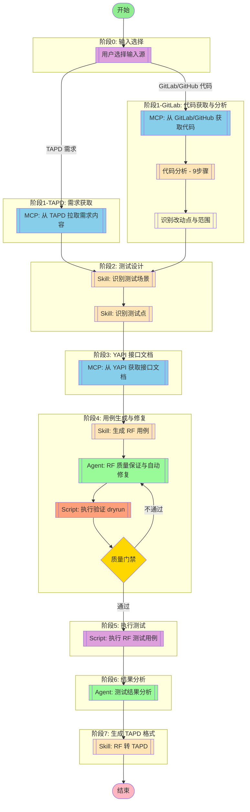

## 工作流执行指南

### 输入源选择

工作流支持两种输入模式启动：

1. **TAPD 需求模式** - 从 TAPD 拉取需求内容进行分析
2. **GitLab/GitHub 代码模式** - 从代码仓库获取代码变更进行分析

**选择逻辑**：
- 如果用户提供 TAPD 需求链接 → 走 TAPD 分支
- 如果用户提供 GitLab/GitHub 仓库路径和分支/Commit → 走代码分析分支

### MCP 工具节点

#### input_select(输入源选择)

- **描述**: 询问用户选择输入源类型
- **交互**: "请选择输入源：1) TAPD 需求  2) GitLab/GitHub 代码分析"
- **分支**:
  - 选择 1 → 进入 `mcp_fetch` 节点
  - 选择 2 → 进入 `mcp_gitlab` 节点

#### mcp_fetch(MCP 自动选择) - AI 工具选择模式

<!-- MCP_NODE_METADATA: {"mode":"aiToolSelection","serverId":"tapd","userIntent":"开始流程后不要理解工作，而是等待用户输入需求链接。\n不需要询问用户使用什么方式传达tapd需求，直接索取链接，不要让用户进行选择。\n根据链接查询对应的需求内容并拉取。workspace_id = 48200023，请注意解析出对应的服务名和需求id."} -->

**MCP 服务器**: tapd

**验证状态**: 有效

**用户意图（自然语言任务描述）**:

```
开始流程后不要理解工作，而是等待用户输入需求链接。
不需要询问用户使用什么方式传达tapd需求，直接索取链接，不要让用户进行选择。
根据链接查询对应的需求内容并拉取。workspace_id = 48200023，请注意解析出对应的服务名和需求id.
```

**执行方法**:

Claude Code 应分析上述任务描述，在运行时查询 MCP 服务器 "tapd" 获取当前工具列表。然后，选择最合适的工具，并根据任务要求确定适当的参数值。

#### mcp_gitlab(MCP 自动选择) - git clone 备用模式

<!-- MCP_NODE_METADATA: {"mode":"aiToolSelection","serverId":"gitlab","userIntent":"从 GitLab 获取指定仓库的代码。用户可选择指定分支（如 develop、master）或指定 commit。获取代码后用于分析改动点。\n注意：GitLab MCP 服务器 (@modelcontextprotocol/server-gitlab) 已被归档，使用 git clone 备用方案。使用系统环境变量中的 GITLAB_API_URL 和 GITLAB_PERSONAL_ACCESS_TOKEN 进行后续操作。"} -->

**说明**: GitLab MCP 服务器已归档，使用 git clone 备用方案

**验证状态**: 已降级，使用 git clone

**用户意图（自然语言任务描述）**:

```
从 GitLab 获取指定仓库的代码。
用户可选择指定分支（如 develop、master）或指定 commit。
获取代码后用于分析改动点。
注意：GitLab MCP 服务器 (@modelcontextprotocol/server-gitlab) 已被归档，使用 git clone 备用方案。
使用系统环境变量中的 GITLAB_API_URL 和 GITLAB_PERSONAL_ACCESS_TOKEN 进行后续操作。
```

**执行方法**:

1. 解析用户输入的 GitLab 项目路径（如 `pay-plus/merch/access/merch-access-standard`）
2. 使用 git clone 获取代码（深度1，减少下载量）
3. 代码下载到临时目录（`$TMPDIR/rf-testing/`）
4. **环境变量使用**:
   - `GITLAB_API_URL`: GitLab API 地址（如 `https://gitlab.jlpay.com/api/v4`），用于后续 API 调用
   - `GITLAB_PERSONAL_ACCESS_TOKEN`: GitLab Personal Access Token，用于 API 认证

**示例**:
```bash
# 解析项目路径
project_path="pay-plus/merch/access/merch-access-standard"
git_base_url="gitlab.jlpay.com"

# 使用 git clone 获取代码
cd "$TMPDIR" && mkdir -p rf-testing && cd rf-testing
git clone --depth 1 https://gitlab.jlpay.com/$project_path
```

<!-- MCP_NODE_METADATA: {"mode":"aiToolSelection","serverId":"gitlab","userIntent":"从 GitLab 或 GitHub 获取指定仓库的代码。\n用户可选择指定分支（如 develop、master）或指定 commit。\n获取代码后用于分析改动点。"} -->

**MCP 服务器**: gitlab

**验证状态**: 有效

**用户意图（自然语言任务描述）**:

```
从 GitLab 或 GitHub 获取指定仓库的代码。
用户可选择指定分支（如 develop、master）或指定 commit。
获取代码后用于分析改动点。
```

**参数**:
- `project_path`: GitLab 项目路径（如 `group/project`）
- `branch_or_commit`: 分支名或 commit SHA
- `output_dir`: 代码输出目录（临时）

**执行方法**:

Claude Code 应分析上述任务描述，在运行时查询 MCP 服务器 "gitlab" 获取当前工具列表。然后，选择最合适的工具，并根据任务要求确定适当的参数值。

#### code_analysis(代码分析)

- **Agent**: testing-code-analyzer
- **职责**: 使用 analyze 指令进行完整代码分析（9步骤）
- **执行方法**:
  1. 结构分析（3步）: 技术栈 → 实体ER图 → 接口入口
  2. 流程分析（3步）: 调用链 → 时序 → 复杂逻辑
  3. 影响面分析（3步）: 依赖引用 → 数据影响 → 风险评估
- **输入**: 从 GitLab/GitHub 获取的代码路径
- **输出**: 完整代码分析报告（结构分析、流程分析、影响面分析）
- **重要**: 必须完成全部9步分析后才能进入下一阶段

#### change_detect(改动点识别)

- **Agent**: testing-change-detector
- **职责**: 基于代码分析结果识别改动点和测试范围
- **输入**: 代码分析报告（来自 testing-code-analyzer）、基准版本（如 main 分支）
- **执行步骤**:
  1. **改动点识别**: 对比基线版本和目标版本，识别新增/修改/删除的代码
  2. **影响面分析**: 分析改动点的依赖关系，识别受影响的调用方和数据流
  3. **测试建议生成**: 针对每个改动点生成测试建议，区分功能测试和回归测试
  4. **回归测试范围确定**: 基于影响面确定回归范围，输出回归测试清单
- **输出**:
  - 改动点清单（新增/修改/删除的代码位置和类型）
  - 影响面分析（接口变更影响、数据模型变更影响）
  - 测试建议（高/中优先级测试点、回归测试范围）
  - 风险评估（风险等级、缓解措施）
- **重要**: 必须基于完整的代码分析报告进行分析

#### mcp_yapi(MCP 自动选择) - AI 工具选择模式

<!-- MCP_NODE_METADATA: {"mode":"aiToolSelection","serverId":"yapi-auto-mcp","userIntent":"根据需求中的接口名称，从 YAPI 获取接口文档。\n提取接口的请求参数、响应格式、示例数据等。"} -->

**MCP 服务器**: yapi-auto-mcp

**验证状态**: 有效

**用户意图（自然语言任务描述）**:

```
根据需求中的接口名称，从 YAPI 获取接口文档。
提取接口的请求参数、响应格式、示例数据等。
```

**执行方法**:

Claude Code 应分析上述任务描述，在运行时查询 MCP 服务器 "yapi-auto-mcp" 获取当前工具列表。然后，选择最合适的工具，并根据任务要求确定适当的参数值。

**YAPI 项目 Token 说明**:
- YAPI 每个项目有唯一的 `project_id` 和 `project_token`
- Token 格式为 `{project_id}:{project_token}`
- 示例：`123:abc456def789` 其中 `123` 是项目ID，`abc456def789` 是项目Token
- 项目Token 在 YAPI 项目设置中生成和查看
- 环境变量配置：`export YAPI_TOKEN="123:abc456def789"`

### 技能节点

#### skill_scenario(识别测试场景)

- **提示**: skill "rf-test" "根据需求内容或代码分析结果，识别测试场景"

**输入（GitLab模式）**:
- 代码分析报告（已完成）
- 改动点清单
- 测试建议

**执行时机**: 必须在代码分析完成后执行

#### skill_points(识别测试点)

- **提示**: skill "rf-test" "根据测试场景，识别具体测试点"

**输入（GitLab模式）**:
- 测试场景列表
- 改动点清单
- 影响面分析

#### skill_generation(生成 RF 用例)

- **提示**: skill "rf-test" "根据测试点生成 RF 测试用例"

**生成要求（强制）**:

生成 RF 用例时必须创建**标准目录结构**，包含 4 个核心文件：

```
<需求名称>_测试套件/
├── Settings.robot          # 套件设置和初始化
├── Keywords.robot          # 用户关键字定义
├── Variables.robot         # 变量定义
└── <需求名称>_测试用例.robot   # 测试用例
```

**文件 1: Settings.robot**
```robotframework
*** Settings ***
Documentation    <需求标题> 测试套件
Resource         Keywords.robot
Resource         Variables.robot
Suite Setup      套件初始化
Suite Teardown   套件清理

*** Keywords ***
套件初始化
    Log    初始化测试环境

套件清理
    Log    清理测试环境
```

**文件 2: Keywords.robot**
```robotframework
*** Settings ***
Documentation    用户关键字定义
Resource         Variables.robot
Library          Collections
Library          RequestsLibrary

*** Keywords ***
# 根据测试点生成对应的业务关键字
```

**文件 3: Variables.robot**
```robotframework
*** Settings ***
Documentation    变量定义

*** Variables ***
# 配置变量
${BASE_URL}       https://api.example.com
${API_TIMEOUT}    30
# 根据需求添加其他变量
```

**文件 4: <需求名称>_测试用例.robot**
```robotframework
*** Settings ***
Documentation    <需求标题> 测试用例
Resource         Settings.robot

*** Test Cases ***
# 用例名称必须使用下划线分隔，禁止空格
# 示例: 商户状态变更_正常变暂停
```

**用例命名规范（强制）**:
- **格式**: `业务操作_具体场景` 或 `业务功能_操作类型`
- **分隔符**: 必须使用下划线 `_`，**禁止使用空格**
- **命名转换**: 自动将描述中的空格替换为下划线

#### skill_conversion(RF 转 TAPD)

- **Skill**: rf-tapd-conversion
- **职责**: 将 RF 用例转换为 TAPD Excel 格式
- **执行步骤**:
  1. **Documentation 格式检查**: 验证所有用例的 [Documentation] 是否包含三段式格式
  2. **执行转换脚本**: 调用 `03-scripts/robot2tapd.py` 生成 Excel
  3. **生成 Base64**: 编码 Excel 文件供 TAPD API 使用
- **脚本调用**:
  ```bash
  python D:\workspace\python\rf-testing-plugin\03-scripts\robot2tapd.py "${robot_file}" --excel "${output_excel}" --creator "${creator}" --out-b64 "${base64_file}"
  ```
- **输入**: RF 用例文件路径
- **输出**: TAPD Excel 文件、Base64 编码
- **常见问题**: 如果输出 "成功处理 0 个测试用例"，说明 [Documentation] 缺少 `【预置条件】【操作步骤】【预期结果】` 三段式标记

### Agent 节点

#### agent_rf_qa(RF 质量保证与自动修复)

- **Agent**: testing-rf-quality-assurance
- **职责**: 验证生成的 RF 用例是否符合 JL 企业标准和最佳实践，**自动修复可修复的问题**

**自动修复能力**:
1. **目录结构修复**: 自动创建缺失的 Settings.robot、Keywords.robot、Variables.robot
2. **用例命名修复**: 自动将用例名称中的空格替换为下划线
3. **Documentation 修复**: 自动调整三段式格式
4. **变量命名修复**: 自动将驼峰命名改为蛇形命名
5. **标签补充**: 自动补充缺失的 Tags 和 Timeout

**检查项**:
- 目录结构（4个标准文件）
- 用例命名（下划线分隔，无空格）
- 变量命名（蛇形命名法：${变量名}）
- 关键字命名（驼峰命名法：关键字名）
- 文档格式（三段式格式：概述-前置条件-预期结果）
- Tag 使用（优先级、评审状态）
- JSONPath 表达式正确性

**质量评分标准**:
- 90-100分：优秀，可直接进入下一阶段
- 70-89分：良好，修复轻微问题后进入下一阶段
- 50-69分：及格，必须修复问题后重新检查
- <50分：不合格，需要重写用例

**质量门禁**:
- 评分 >= 70分：通过，进入执行验证阶段
- 评分 < 70分：不通过，返回自动修复阶段

#### agent_results(测试结果分析)

- **Agent**: Test Results Analyzer
- **职责**: 分析 RF 测试执行结果，识别失败模式、趋势和系统性质量问题
- **输出**: 质量报告和改进建议

### 脚本节点

#### script_validate(执行验证 dryrun)

- **脚本**: `03-scripts/rf_runner.py`
- **职责**: 使用 dryrun 模式验证 RF 用例语法正确性
- **执行命令**:
  ```bash
  python 03-scripts/rf_runner.py --dryrun --output-dir ./output <test_dir>
  ```
- **验证内容**:
  - 语法正确性
  - Resource 引用正确性
  - 关键字是否存在
  - 变量是否定义
- **输出**: dryrun 结果（通过/失败）

#### script_execute(执行 RF 测试用例)

**自动化执行，无需人工选择 Python 环境**

执行器会自动处理 Python 环境选择：
1. 优先使用安装时保存的 Python 配置
2. 如果没有配置，自动检测并优先选择 Python 3.7.x 版本
3. 执行完成后返回实际使用的 Python 路径

**使用方式**：
```python
from rf_executor import execute_robot_test

# 完全自动化，无需指定 python_path
result = execute_robot_test(robot_file="test.robot")

# 或者指定特定 Python 版本（可选）
result = execute_robot_test(
    robot_file="test.robot",
    python_path="/path/to/python3.7"  # 可选，不指定则自动检测
)
```

- **脚本**: `03-scripts/rf_executor.py`
- **函数**: `execute_robot_test()`
- **职责**: 执行生成的 RF 测试用例，返回执行结果
- **参数**:
  - `robot_file`: .robot 文件路径（必需）
  - `python_path`: Python 环境路径（可选，自动检测）
  - `test_name`: 执行指定测试用例（可选）
  - `suite_name`: 执行指定测试套件（可选）
  - `output_dir`: 输出目录（默认: ./output）
- **返回值**:
  - `success`: 执行是否成功
  - `statistics`: 统计信息（总数/通过/失败/跳过）
  - `tests`: 测试用例列表
  - `log_file`: HTML 日志文件路径
  - `report_file`: HTML 报告文件路径
  - `python_path`: 实际使用的 Python 路径

## 工作流说明

### 执行流程

#### 模式 A: TAPD 需求模式

1. **输入选择** - 用户选择 TAPD 需求模式
2. **需求获取** - 从 TAPD 拉取需求内容
3. **测试设计** - 识别测试场景和测试点
4. **接口文档** - 从 YAPI 获取接口文档
5. **用例生成** - 生成符合 RF 规范的测试用例（4个标准文件）
6. **质量保证与自动修复** - RF 质量保证 Agent 检查并自动修复问题
7. **执行验证** - 使用 dryrun 验证用例语法正确性
8. **质量门禁** - 评分 >= 70分通过，否则返回修复
9. **执行测试** - 执行 RF 测试用例并验证
10. **结果分析** - 测试结果分析 Agent 分析质量指标
11. **TAPD 转换** - 将 RF 用例转换为 TAPD 格式（生成 Excel）

#### 模式 B: GitLab/GitHub 代码分析模式

**阶段1: 代码获取与分析（必须完整完成）**
1. **输入选择** - 用户选择代码分析模式
2. **代码获取** - 从 GitLab/GitHub 获取指定分支或 commit 的代码
3. **代码分析** - 使用 analyze 指令进行完整分析（9步骤，必须全部完成）
   - 结构分析（3步）: 技术栈 → 实体ER图 → 接口入口
   - 流程分析（3步）: 调用链 → 时序 → 复杂逻辑
   - 影响面分析（3步）: 依赖引用 → 数据影响 → 风险评估
4. **改动点识别** - 基于完整的代码分析报告，识别改动点和测试范围

**阶段2: 测试设计（基于分析结果）**
5. **测试设计** - 基于改动点识别测试场景和测试点
6. **接口文档** - 从 YAPI 获取接口文档（如有）

**阶段3: 用例生成与验证**
7. **用例生成** - 生成符合 RF 规范的测试用例（4个标准文件）
8. **质量保证与自动修复** - RF 质量保证 Agent 检查并自动修复问题
9. **执行验证** - 使用 dryrun 验证用例语法正确性
10. **质量门禁** - 评分 >= 70分通过，否则返回修复

**阶段4: 执行与输出**
11. **执行测试** - 执行 RF 测试用例并验证
12. **结果分析** - 测试结果分析 Agent 分析质量指标
13. **TAPD 转换** - 将 RF 用例转换为 TAPD 格式（生成 Excel）

### 重要执行原则

**GitLab/GitHub 代码分析模式必须遵循**：
1. **代码分析必须完整** - 9步骤分析（结构3步 + 流程3步 + 影响面3步）必须全部完成
2. **改动点识别必须基于完整分析** - 不能跳过或简化代码分析阶段
3. **测试设计必须基于分析结果** - 测试场景和测试点必须基于改动点清单
4. **禁止混用阶段** - 代码分析和用例生成是不同的阶段，不能同时进行

### 配置参数

**输出目录规范**：
- **临时文件**（拉取的代码、中间结果）：使用系统临时目录下的 `rf-testing/` 子目录
  - Windows: `%TEMP%/rf-testing/` (如 `C:\Users\<username>\AppData\Local\Temp\rf-testing\`)
  - Linux/macOS: `$TMPDIR/rf-testing/` (如 `/tmp/rf-testing/`)
- **最终输出文件**（RF 用例、报告）：使用当前工作目录下的 `./output/`

```json
{
  "tapd_workspace_id": "48200023",
  "temp_dir": "${TMPDIR}/rf-testing/",
  "output_dir": "./output",
  "creator": "测试工程师",
  "test_case_priority": "P0,P1,P2",
  "gitlab": {
    "api_url": "${GITLAB_API_URL}",
    "token": "${GITLAB_PERSONAL_ACCESS_TOKEN}"
  },
  "github": {
    "token": "${GITHUB_TOKEN}"
  }
}
```

**重要提示**：
- 所有临时文件（包括从 GitLab/GitHub 拉取的代码）必须存放在系统临时目录下
- 最终生成的 RF 用例文件和报告存放在当前工作目录的 `./output/` 下
- 临时目录中的文件在任务完成后可以清理

### 输出结果

- RF 用例文件（标准4文件结构）
- 代码分析报告（GitLab模式）
- 改动点清单（GitLab模式）
- 质量保证报告（含自动修复记录）
- 执行验证报告（dryrun 结果）
- 测试执行报告
- HTML 日志和报告
- 测试结果分析报告
- TAPD Excel 文件
- 用例数量统计
