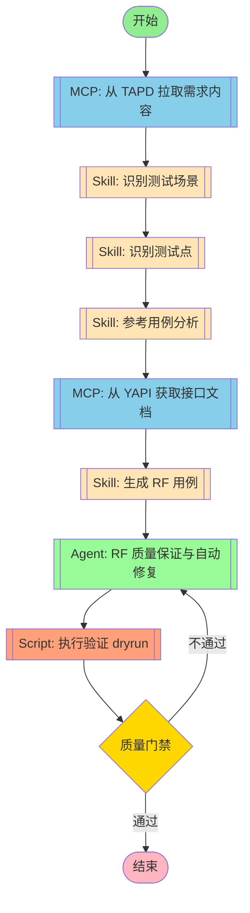

## 工作流执行指南

### MCP 工具节点

#### mcp_fetch(MCP 自动选择) - AI 工具选择模式

<!-- MCP_NODE_METADATA: {"mode":"aiToolSelection","serverId":"plugin:rf-testing:tapd","userIntent":"开始流程后不要理解工作，而是等待用户输入需求链接。\n不需要询问用户使用什么方式传达tapd需求，直接索取链接，不要让用户进行选择。\n根据链接查询对应的需求内容并拉取。workspace_id = 48200023，请注意解析出对应的服务名和需求id."} -->

**MCP 服务器**: tapd

**验证状态**: 有效

**用户意图（自然语言任务描述）**:

```
开始流程后不要理解工作，而是等待用户输入需求链接。
不需要询问用户使用什么方式传达tapd需求，直接索取链接，不要让用户进行选择。
根据链接查询对应的需求内容并拉取。workspace_id = 48200023，请注意解析出对应的服务名和需求id.
```

**执行方法**:

Claude Code 应分析上述任务描述，在运行时查询 MCP 服务器 "tapd" 获取当前工具列表。然后，选择最合适的工具，并根据任务要求确定适当的参数值。

#### mcp_yapi(MCP 自动选择) - AI 工具选择模式

<!-- MCP_NODE_METADATA: {"mode":"aiToolSelection","serverId":"yapi-auto-mcp","userIntent":"根据需求中的接口名称，从 YAPI 获取接口文档。\n提取接口的请求参数、响应格式、示例数据等。"} -->

**MCP 服务器**: yapi-auto-mcp

**验证状态**: 有效

**用户意图（自然语言任务描述）**:

```
根据需求中的接口名称，从 YAPI 获取接口文档。
提取接口的请求参数、响应格式、示例数据等。
```

**执行方法**:

Claude Code 应分析上述任务描述，在运行时查询 MCP 服务器 "yapi-auto-mcp" 获取当前工具列表。然后，选择最合适的工具，并根据任务要求确定适当的参数值。

**YAPI 集成说明**:

YAPI MCP 提供以下工具用于接口文档获取：

| 工具 | 功能 | 参数 |
|------|------|------|
| `search_interfaces` | 按名称、路径或标签搜索接口 | `keyword`, `method`, `tag` |
| `get_interface_detail` | 获取接口详细信息 | `interface_id`, `project_id` |
| `list_projects` | 列出所有项目 | 无 |
| `list_categories` | 列出项目分类 | `project_id` |

**环境变量配置**:
```bash
export YAPI_BASE_URL="https://yapi.example.com"
export YAPI_TOKEN="123:abc456,456:def789"  # 格式: projectId:projectToken
```

**项目 Token 说明**:
- YAPI 中每个项目有唯一的 `project_id` 和 `project_token`
- Token 格式为 `{project_id}:{project_token}`
- 示例：`123:abc456def789` 其中 `123` 是项目ID，`abc456def789` 是项目Token
- 项目Token 可在 YAPI 项目设置中查看和生成
- 使用此 token 可以请求项目的 OpenAPI 规范

**使用流程**:
1. 从需求内容中提取接口名称/路径关键词
2. 配置正确的 YAPI_TOKEN（包含项目ID和项目Token）
3. 调用 `search_interfaces` 搜索匹配的接口
4. 调用 `get_interface_detail` 获取完整接口定义
5. 提取请求参数、响应格式、示例数据等
6. 将接口信息传递给 RF 用例生成阶段

### 技能节点

#### skill_scenario(识别测试场景)

- **提示**: skill "rf-test" "根据需求内容，识别测试场景"

#### skill_points(识别测试点)

- **提示**: skill "rf-test" "根据测试场景，识别具体测试点"

#### skill_reference_analysis(参考用例分析) - **新增步骤**

- **提示**: 在生成测试用例之前，询问用户是否有现有用例目录可供参考和学习风格
- **目的**：
  - 分析现有用例，提取可复用的关键字和变量
  - 学习现有用例的命名风格和结构规范
  - 避免重复造轮子，复用已有资源
- **询问内容**：
  - 是否有现有用例目录？
  - 如果有，请提供目录路径
  - 用户希望完全复用现有风格，还是仅作参考？
- **分析输出**：
  - 可复用关键字清单
  - 可复用变量清单
  - 风格学习报告（命名规范、目录结构、注释风格等）
  - 复用建议报告

- **提示**: skill "rf-test" "分析参考用例，提取可复用的关键字和变量"

**输入参数**:
- `reference_cases_dir`: 参考用例目录路径

**分析内容**:
1. **扫描参考目录**:
   - 查找所有 `.robot` 文件
   - 解析 `*** Keywords ***` 节，提取已有关键字
   - 解析 `*** Variables ***` 节，提取已有变量

2. **提取可复用内容**:
   - **关键字列表**: 关键字名称、参数、功能描述
   - **变量列表**: 变量名称、值、用途说明
   - **引用关系**: 关键字间的调用关系

3. **生成复用建议**:
   - 标记可直接复用的关键字
   - 标记需要修改的关键字
   - 标记需要新增的关键字

**复用原则**:
- ✅ **优先复用**: 功能完全匹配的关键字
- ✅ **引用复用**: 通过 Resource 引用已有文件
- ⚠️ **谨慎修改**: 不要轻易修改 Variables.robot 中已存在的变量
- ❌ **禁止重复**: 禁止重复实现已有功能的关键字

**输出**:
- 可复用关键字清单
- 可复用变量清单
- 复用建议报告

#### skill_generation(生成 RF 用例)

- **提示**: skill "rf-test" "根据测试点生成 RF 测试用例"

**用例命名规范（强制）**:
1. **格式**: `业务操作_具体场景` 或 `业务功能_操作类型`
2. **分隔符**: 必须使用下划线 `_`，禁止使用空格
3. **命名转换规则**:
   - 将业务描述中的空格替换为下划线
   - 示例: `商户状态变更 正常变暂停` → `商户状态变更_正常变暂停`
   - 示例: `生成入网商户号 首次` → `生成入网商户号_首次`
4. **命名示例**:
   - ✅ `商户绑定套餐_开关授权收款套餐`
   - ✅ `电签首次入网门店认证并加机`
   - ❌ `商户状态变更 正常变暂停` (包含空格)

**标准目录结构（强制）**:

必须生成以下 4 个文件，形成标准目录结构：

```
<需求名称>_测试套件/
├── Settings.robot          # 套件设置和初始化
├── Keywords.robot          # 用户关键字定义
├── Variables.robot         # 变量定义
└── <需求名称>_测试用例.robot   # 测试用例
```

**文件 1: Settings.robot**
```robotframework
*** Settings ***
Documentation    <需求标题> 测试套件
Resource         Keywords.robot
Resource         Variables.robot
Suite Setup      套件初始化
Suite Teardown   套件清理

*** Variables ***
# 套件级变量
${SUITE_PRIORITY}    P0

*** Keywords ***
套件初始化
    Log    初始化测试环境

套件清理
    Log    清理测试环境
```

**注意事项**：
- Settings.robot 是测试套件的主文件，包含 Suite Setup/Teardown
- Suite Setup/Teardown 只能出现在测试套件文件中，**不能**出现在被 Resource 引用的文件中
- Keywords.robot 和 Variables.robot 是 Resource 文件，不应该包含 Suite Setup/Teardown

**文件 2: Keywords.robot**
```robotframework
*** Settings ***
Documentation    用户关键字定义
Resource         Variables.robot
Library          Collections
Library          RequestsLibrary

*** Keywords ***
# 根据测试点生成对应的业务关键字
```

**文件 3: Variables.robot**
```robotframework
*** Settings ***
Documentation    变量定义

*** Variables ***
# 配置变量
${BASE_URL}       https://api.example.com
${API_TIMEOUT}    30
# 根据需求添加其他变量
```

**文件 4: <需求名称>_测试用例.robot**
```robotframework
*** Settings ***
Documentation    <需求标题> 测试用例
Resource         Settings.robot

*** Test Cases ***
# 根据测试点生成测试用例
# 用例名称必须使用下划线分隔，禁止空格
```

**生成要求**:
1. 每个测试用例名称必须通过命名规范化处理（空格替换为下划线）
2. 必须生成 4 个标准文件，而非单个文件
3. 文件内容必须符合 Robot Framework 3.2.2 规范
4. 确保用例名称符合项目命名规范
5. **优先复用参考用例中的关键字和变量**

### Agent 节点

#### agent_rf_qa(RF 质量保证与自动修复)

- **Agent**: testing-rf-quality-assurance
- **职责**: 验证生成的 RF 用例是否符合 JL 企业标准和最佳实践，**自动修复可修复的问题**

**自动修复能力**:
1. **目录结构修复**: 自动创建缺失的 Settings.robot、Keywords.robot、Variables.robot
2. **用例命名修复**: 自动将用例名称中的空格替换为下划线
3. **Documentation 修复**: 自动调整三段式格式
4. **变量命名修复**: 自动将驼峰命名改为蛇形命名
5. **标签补充**: 自动补充缺失的 Tags 和 Timeout

**检查项**:
- 目录结构（4个标准文件）
- 用例命名（下划线分隔，无空格）
- 变量命名（蛇形命名法：${变量名}）
- 关键字命名（驼峰命名法：关键字名）
- 文档格式（三段式格式：概述-前置条件-预期结果）
- Tag 使用（优先级、评审状态）
- JSONPath 表达式正确性

**质量评分标准**:
- 90-100分：优秀，可直接进入下一阶段
- 70-89分：良好，修复轻微问题后进入下一阶段
- 50-69分：及格，必须修复问题后重新检查
- <50分：不合格，需要重写用例

**质量门禁**:
- 评分 >= 70分：通过，完成工作流
- 评分 < 70分：不通过，返回自动修复阶段

### 脚本节点

#### script_validate(执行验证 dryrun)

- **脚本**: `03-scripts/rf_runner.py`
- **职责**: 使用 dryrun 模式验证 RF 用例语法正确性
- **执行命令**:
  ```bash
  python 03-scripts/rf_runner.py --dryrun --output-dir ./output <test_dir>
  ```
- **验证内容**:
  - 语法正确性
  - Resource 引用正确性
  - 关键字是否存在
  - 变量是否定义
- **输出**: dryrun 结果（通过/失败）

## 工作流说明

### 执行流程

1. **需求获取** - 从 TAPD 拉取需求内容
2. **场景识别** - 识别测试场景
3. **测试点识别** - 识别具体测试点
4. **参考用例分析** - 分析参考用例，提取可复用的关键字和变量
5. **接口文档** - 从 YAPI 获取接口文档
6. **用例生成** - 生成 RF 测试用例（4个标准文件，优先复用已有内容）
7. **质量保证与自动修复** - RF 质量保证 Agent 检查并自动修复问题
8. **执行验证** - 使用 dryrun 验证用例语法正确性
9. **质量门禁** - 评分 >= 70分通过，否则返回修复

### 输入参数

| 参数 | 说明 | 必填 |
|------|------|------|
| requirement_url | TAPD 需求链接 | 是 |
| output_dir | 输出目录 | 否，默认为 ./output |
| creator | 创建人名称 | 否，默认为当前用户 |
| reference_cases_dir | 参考用例目录 | 否，用于复用已有关键字和变量 |

### 输出结果

- **标准目录结构**:
  - `Settings.robot` - 套件设置和初始化
  - `Keywords.robot` - 用户关键字定义
  - `Variables.robot` - 变量定义
  - `<需求名称>_测试用例.robot` - 测试用例
- 质量保证报告（含自动修复记录）
- 执行验证报告（dryrun 结果）
- 用例统计信息
