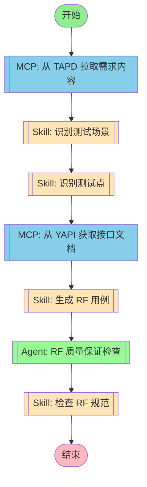

## 工作流执行指南

### MCP 工具节点

#### mcp_fetch(MCP 自动选择) - AI 工具选择模式

<!-- MCP_NODE_METADATA: {"mode":"aiToolSelection","serverId":"tapd","userIntent":"开始流程后不要理解工作，而是等待用户输入需求链接。\n不需要询问用户使用什么方式传达tapd需求，直接索取链接，不要让用户进行选择。\n根据链接查询对应的需求内容并拉取。workspace_id = 48200023，请注意解析出对应的服务名和需求id."} -->

**MCP 服务器**: tapd

**验证状态**: 有效

**用户意图（自然语言任务描述）**:

```
开始流程后不要理解工作，而是等待用户输入需求链接。
不需要询问用户使用什么方式传达tapd需求，直接索取链接，不要让用户进行选择。
根据链接查询对应的需求内容并拉取。workspace_id = 48200023，请注意解析出对应的服务名和需求id.
```

**执行方法**:

Claude Code 应分析上述任务描述，在运行时查询 MCP 服务器 "tapd" 获取当前工具列表。然后，选择最合适的工具，并根据任务要求确定适当的参数值。

#### mcp_yapi(MCP 自动选择) - AI 工具选择模式

<!-- MCP_NODE_METADATA: {"mode":"aiToolSelection","serverId":"yapi-auto-mcp","userIntent":"根据需求中的接口名称，从 YAPI 获取接口文档。\n提取接口的请求参数、响应格式、示例数据等。"} -->

**MCP 服务器**: yapi-auto-mcp

**验证状态**: 有效

**用户意图（自然语言任务描述）**:

```
根据需求中的接口名称，从 YAPI 获取接口文档。
提取接口的请求参数、响应格式、示例数据等。
```

**执行方法**:

Claude Code 应分析上述任务描述，在运行时查询 MCP 服务器 "yapi-auto-mcp" 获取当前工具列表。然后，选择最合适的工具，并根据任务要求确定适当的参数值。

**YAPI 集成说明**:

YAPI MCP 提供以下工具用于接口文档获取：

| 工具 | 功能 | 参数 |
|------|------|------|
| `search_interfaces` | 按名称、路径或标签搜索接口 | `keyword`, `method`, `tag` |
| `get_interface_detail` | 获取接口详细信息 | `interface_id`, `project_id` |
| `list_projects` | 列出所有项目 | 无 |
| `list_categories` | 列出项目分类 | `project_id` |

**环境变量配置**:
```bash
export YAPI_BASE_URL="https://yapi.example.com"
export YAPI_TOKEN="123:abc456,456:def789"  # 格式: projectId:projectToken
```

**项目 Token 说明**:
- YAPI 中每个项目有唯一的 `project_id` 和 `project_token`
- Token 格式为 `{project_id}:{project_token}`
- 示例：`123:abc456def789` 其中 `123` 是项目ID，`abc456def789` 是项目Token
- 项目Token 可在 YAPI 项目设置中查看和生成
- 使用此 token 可以请求项目的 OpenAPI 规范

**使用流程**:
1. 从需求内容中提取接口名称/路径关键词
2. 配置正确的 YAPI_TOKEN（包含项目ID和项目Token）
3. 调用 `search_interfaces` 搜索匹配的接口
4. 调用 `get_interface_detail` 获取完整接口定义
5. 提取请求参数、响应格式、示例数据等
6. 将接口信息传递给 RF 用例生成阶段

### 技能节点

#### skill_scenario(识别测试场景)

- **提示**: skill "rf-test" "根据需求内容，识别测试场景"

#### skill_points(识别测试点)

- **提示**: skill "rf-test" "根据测试场景，识别具体测试点"

#### skill_generation(生成 RF 用例)

- **提示**: skill "rf-test" "根据测试点生成 RF 测试用例"

#### skill_validation(检查 RF 规范)

- **提示**: skill "rf-standards-check"

### Agent 节点

#### agent_rf_qa(RF 质量保证检查)

- **Agent**: testing-rf-quality-assurance
- **职责**: 验证生成的 RF 用例是否符合 JL 企业标准和最佳实践
- **检查项**:
  - 变量命名（蛇形命名法：${变量名}）
  - 关键字命名（驼峰命名法：关键字名）
  - 文档格式（三段式格式：概述-前置条件-预期结果）
  - Tag 使用（优先级、评审状态）
  - JSONPath 表达式正确性

## 工作流说明

### 执行流程

1. **需求获取** - 从 TAPD 拉取需求内容
2. **场景识别** - 识别测试场景
3. **测试点识别** - 识别具体测试点
4. **接口文档** - 从 YAPI 获取接口文档（新增）
5. **用例生成** - 生成 RF 测试用例
6. **质量保证** - RF 质量保证 Agent 检查用例质量
7. **规范检查** - 检查用例规范

### 输入参数

| 参数 | 说明 | 必填 |
|------|------|------|
| requirement_url | TAPD 需求链接 | 是 |
| output_dir | 输出目录 | 否，默认为 ./output |
| creator | 创建人名称 | 否，默认为当前用户 |

### 输出结果

- RF 用例文件（.robot）
- 质量保证报告
- 规范检查报告
- 用例统计信息