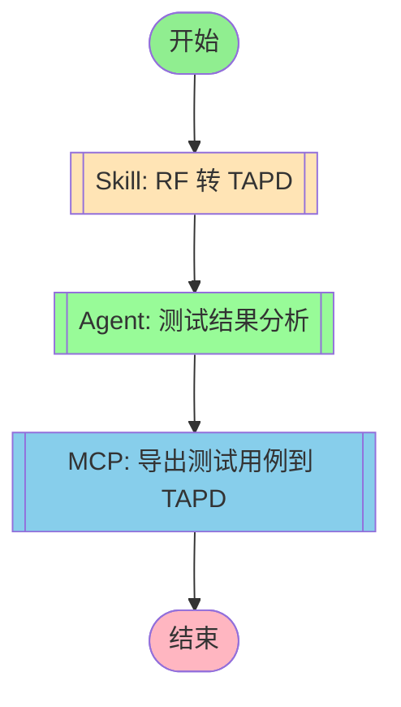

## 工作流执行指南

### MCP 工具节点

#### mcp_export(MCP 自动选择) - AI 工具选择模式

<!-- MCP_NODE_METADATA: {"mode":"aiToolSelection","serverId":"tapd","userIntent":"将生成的测试用例转换为 TAPD 格式，并导出到 TAPD 平台。"} -->

**MCP 服务器**: tapd

**验证状态**: 有效

**用户意图（自然语言任务描述）**:

```
将生成的测试用例转换为 TAPD 格式，并导出到 TAPD 平台。
```

**执行方法**:

Claude Code 应分析上述任务描述，在运行时查询 MCP 服务器 "tapd" 获取当前工具列表。然后，选择最合适的工具，并根据任务要求确定适当的参数值。

### 技能节点

#### skill_conversion(RF 转 TAPD)

- **提示**: skill "rf-tapd-conversion"

### Agent 节点

#### agent_results(测试结果分析)

- **Agent**: Test Results Analyzer
- **职责**: 分析 RF 测试执行结果，识别失败模式、趋势和系统性质量问题
- **输出**: 质量报告和改进建议

## 工作流说明

### 执行流程

1. **TAPD 转换** - 将 RF 用例转换为 TAPD Excel 格式
2. **结果分析** - 测试结果分析 Agent 分析质量指标
3. **导出上传** - 将转换结果导出并上传到 TAPD

### 输入参数

| 参数 | 说明 | 必填 |
|------|------|------|
| robot_file | RF 用例文件路径 | 是 |
| output_excel | 输出 Excel 路径 | 否，默认为原文件名.xlsx |
| creator | 创建人名称 | 否，默认为当前用户 |

### 输出结果

- TAPD Excel 文件
- Base64 编码文件
- 质量分析报告
- 用例数量统计
- 导出结果

### 批量转换

```bash
# 批量转换整个目录
python 03-scripts/batch_convert.sh ./cases ./output "测试工程师"
```