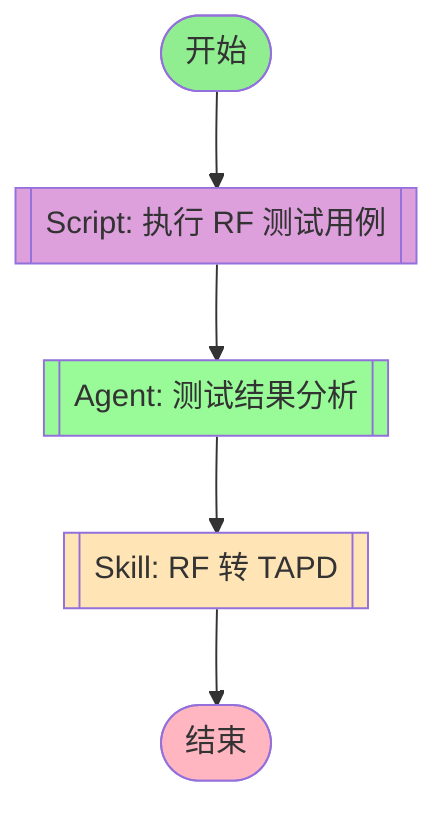

## 工作流执行指南

**说明**: 本工作流专注于生成 TAPD Excel 格式文件，不涉及上传到 TAPD 平台。

### 脚本节点

#### script_execute(执行 RF 测试用例)

- **脚本**: `03-scripts/rf_executor.py`
- **函数**: `execute_robot_test()`
- **职责**: 执行生成的 RF 测试用例，返回执行结果
- **参数**:
  - `robot_file`: .robot 文件路径
  - `python_path`: Python 环境路径（可选，自动检测）
  - `test_name`: 执行指定测试用例（可选）
  - `suite_name`: 执行指定测试套件（可选）
  - `output_dir`: 输出目录（默认: ./output）
- **返回值**:
  - `success`: 执行是否成功
  - `statistics`: 统计信息（总数/通过/失败/跳过）
  - `tests`: 测试用例列表
  - `log_file`: HTML 日志文件路径
  - `report_file`: HTML 报告文件路径

### 技能节点

#### skill_conversion(RF 转 TAPD)

- **Skill**: rf-tapd-conversion
- **职责**: 将 RF 用例文件转换为 TAPD Excel 格式
- **执行步骤**:
  1. **解析 RF 文件**: 读取 .robot 文件，提取用例名称和 [Documentation]
  2. **格式检查**: 检查 [Documentation] 是否包含三段式格式（【预置条件】【操作步骤】【预期结果】）
  3. **执行转换脚本**: 调用 `03-scripts/robot2tapd.py` 生成 Excel 文件
  4. **生成 Base64**: 将 Excel 文件编码为 Base64 字符串
- **脚本调用示例**:
  ```bash
  python D:\workspace\python\rf-testing-plugin\03-scripts\robot2tapd.py \
      "${robot_file}" \
      --excel "${output_excel}" \
      --creator "${creator}" \
      --out-b64 "${base64_file}"
  ```
- **输入参数**:
  - `robot_file`: RF 用例文件路径（必需）
  - `output_excel`: 输出 Excel 路径（可选，默认: 自动化用例导出.xlsx）
  - `creator`: 创建人名称（可选，默认: 徐俊康）
  - `base64_file`: Base64 输出文件路径（可选）
- **输出**: TAPD Excel 格式文件、Base64 编码字符串
- **注意事项**:
  - 如果输出 "成功处理 0 个测试用例"，说明 [Documentation] 格式不正确
  - 必须确保 [Documentation] 包含 `【预置条件】`、`【操作步骤】`、`【预期结果】` 三个标记

### Agent 节点

#### agent_results(测试结果分析)

- **Agent**: Test Results Analyzer
- **职责**: 分析 RF 测试执行结果，识别失败模式、趋势和系统性质量问题
- **输入**: RF 执行器返回的测试结果（statistics, tests, log_file, report_file）
- **输出**: 质量报告和改进建议

**错误诊断能力**：
- 不简单归因为测试环境问题
- 分析具体失败原因：断言失败、接口返回错误、数据异常、超时等
- 提供可操作的修复建议
- 标记需要人工介入的问题

**分析维度**：
1. **失败模式识别**：
   - 断言失败：预期值 vs 实际值
   - 接口错误：HTTP 状态码、错误消息
   - 数据异常：字段缺失、格式错误
   - 超时问题：响应时间过长

2. **错误分类**：
   - 测试用例问题：预期设置错误、断言不合理
   - 环境问题：服务不可用、配置错误
   - 数据问题：测试数据不完整、状态冲突
   - 接口问题：接口变更、参数错误

3. **根因分析**：
   - 基于失败堆栈和日志分析根本原因
   - 识别系统性问题 vs 随机性失败
   - 提供具体修复建议

## 工作流说明

### 执行流程

1. **执行测试** - 执行 RF 测试用例并验证（新增）
2. **结果分析** - 测试结果分析 Agent 分析质量指标
3. **TAPD 转换** - 将 RF 用例转换为 TAPD Excel 格式
4. **导出上传** - 将转换结果导出并上传到 TAPD

### 输入参数

| 参数 | 说明 | 必填 |
|------|------|------|
| robot_file | RF 用例文件路径 | 是 |
| output_excel | 输出 Excel 路径 | 否，默认为原文件名.xlsx |
| creator | 创建人名称 | 否，默认为当前用户 |

### 输出结果

- 测试执行报告（新增）
- HTML 日志和报告（新增）
- TAPD Excel 文件
- Base64 编码文件
- 质量分析报告
- 用例数量统计
- 导出结果

### 批量转换

```bash
# 批量转换整个目录
python 03-scripts/batch_convert.sh ./cases ./output "测试工程师"
```