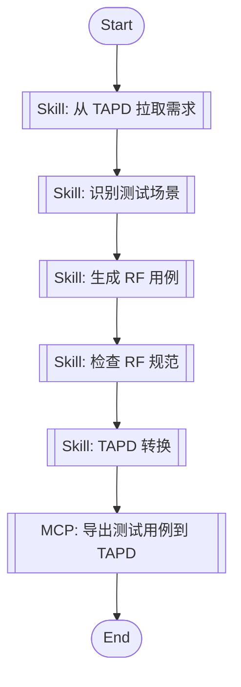

# RF 测试插件实现计划

> **For agentic workers:** REQUIRED SUB-SKILL: Use superpowers:subagent-driven-development (recommended) or superpowers:executing-plans to implement this plan task-by-task. Steps use checkbox (`- [ ]`) syntax for tracking.

**目标**: 将现有 Robot Framework 测试资产重构为符合 AI-First 插件标准的 Claude 插件

**架构**: 对标 AI-First 开发插件架构，采用 Mermaid flowchart 工作流编排，遵循统一交互协议和 SKILL.md 格式。

**技术栈**: Python 3.10+, Claude Plugin API, Mermaid, MCP (TAPD)

---

## 任务概览

本计划将创建符合 AI-First 标准的 RF 测试插件，包括：

1. **阶段1：目录结构创建** - 建立标准目录结构
2. **阶段2：插件元数据** - 创建 marketplace.json 和 plugin.json
3. **阶段3：JL 公共库** - 迁移和生成指令、规范、模板
4. **阶段4：RF 技能实现** - 实现测试相关 SKILL.md
5. **阶段5：工作流定义** - 创建 Mermaid flowchart 工作流
6. **阶段6：脚本增强** - 迁移和增强转换脚本
7. **阶段7：文档完善** - 创建 README 和使用案例

---

## 文件结构映射

| 新文件路径 | 说明 | 依赖 |
|------------|------|--------|
| `.claude-plugin/marketplace.json` | Claude Plugin Marketplace 注册 | 无 |
| `.claude-plugin/plugin.json` | Plugin Plugin 基础信息 | 无 |
| `00-JL-Skills/jl-skills/instructions/INTERACTION_PROTOCOL.md` | 交互协议（复用） | AI-First 源码 |
| `00-JL-Skills/jl-skills/instructions/test/scenario-identification-instructions.md` | 场景识别指令 | 新建 |
| `00-JL-Skills/jl-skills/instructions/test/script-generation-instructions.md` | 脚本生成指令 | 新建 |
| `00-JL-Skills/jl-skills/instructions/test/report-generation-instructions.md` | 报告生成指令 | 新建 |
| `00-JL-Skills/jl-skills/specs/Robot Framework 编写规范.md` | RF 编写规范（拆分） | robotframeworkruls.mdc |
| `00-JL-Skills/jl-skills/specs/JSONPath 使用指南.md` | JSONPath 指南（拆分） | robotframeworkruls.mdc |
| `00-JL-Skills/jl-skills/specs/测试设计模式.md` | 测试设计模式 | testing-capabilities.md |
| `00-JL-Skills/jl-skills/templates/JL-Template-RF-TestCase.md` | RF 用例模板 | 新建 |
| `00-JL-Skills/jl-skills/templates/JL-Template-RF-Keyword.md` | RF 关键字模板 | 新建 |
| `00-JL-Skills/jl-skills/templates/JL-Template-TAPD-Report.md` | TAPD 报告模板 | 新建 |
| `01-RF-Skills/skills/test/SKILL.md` | 测试技能主入口 | 新建 |
| `01-RF-Skills/skills/rf-standards-check/SKILL.md` | RF 规范检查查能 | 新建 |
| `01-RF-Skills/skills/tapd-conversion/SKILL.md` | TAPD 转换技能 | 新建 |
| `01-RF-Skills/skills/tapd-conversion/references/TAPD_spec.md` | TAPD 规范 | 新建 |
| `02-workflows/full-test-pipeline.md` | 完整测试流程 | 新建 |
| `02-workflows/requirement-to-rf.md` | 需求转用例 | 新建 |
| `02-RF-Skills/workflows/rf-to-tapd.md` | RF 转 TAPD | 新建 |
| `03-scripts/robot2tapd.py` | 增强的转换脚本 | robot2excel_tapd_base64.py |
| `03-scripts/batch_convert.sh` | 批量转换脚本 | 新建 |
| `04-cases/README.md` | 使用案例 | 新建 |
| `README.md` | 插件说明 | 新建 |

---

## 实现任务

### Task 1: 创建目录结构

**Files:**
- Create: `.claude-plugin/`
- Create: `00-JL-Skills/jl-skills/`
- Create: `00-JL-Skills/jl-skills/instructions/test/`
- Create: `00-JL-Skills/jl-skills/specs/`
- Create: `00-JL-Skills/jl-skills/templates/`
- Create: `01-RF-Skills/skills/`
- Create: `01-RF-Skills/skills/rf-standards-check/`
- Create: `01-RF-Skills/skills/tapd-conversion/`
- Create: `01-RF-Skills/skills/tapd-conversion/references/`
- Create: `02-workflows/`
- Create: `03-scripts/`
- Create: `04-cases/`

- [ ] **Step 1: 创建核心目录结构**

创建插件根目录结构，包括所有必要的子目录：

```bash
mkdir -p .claude-plugin
mkdir -p 00-JL-Skills/jl-skills/instructions/test
mkdir -p 00-JL-Skills/jl-skills/specs
mkdir -p 00-JL-Skills/jl-skills/templates
mkdir -p 01-RF-Skills/skills/test
mkdir -p 01-RF-Skills/skills/rf-standards-check
mkdir -p 01-RF-Skills/skills/tapd-conversion/references
mkdir -p 02-workflows
mkdir -p 03-scripts
mkdir -p 04-cases
```

- [ ] **Step 2: 验证目录结构**

检查所有必要目录是否创建成功：

```bash
ls -la | grep -E "(00-JL-Skills|01-RF-Skills|02-workflows|03-scripts|04-cases|.claude-plugin)"
```

- [ ] **Step 3: 提交目录结构**

```bash
git add .claude-plugin/ 00-JL-Skills/ 01-RF-Skills/ 02-workflows/ 03-scripts/ 04-cases/
git commit -m "feat: 创建 RF 测试插件目录结构"
```

---

### Task 2: 创建 Plugin 元数据

**Files:**
- Create: `.claude-plugin/marketplace.json`
- Create: `.claude-plugin/plugin.json`

- [ ] **Step 1: 创建 marketplace.json**

```json
{
  "name": "rf-testing-plugin",
  "owner": {
    "name": "your-name"
  },
  "metadata": {
    "description": "Robot Framework 测试用例生成与转换插件，对标开发工作流提供测试工程师视角能力。",
    "version": "1.0.0"
  },
  "plugins": [
    {
      "name": "rf-testing-plugin",
      "source": "./00-JL-Skills",
      "description": "根据 TAPD 需求自动生成 RF 用例并转换为 TAPD 格式，对标开发工作流的测试闭环。",
      "version": "1.0.0",
      "author": {
        "name": "your-name"
      },
      "category": "testing",
      "tags": [
        "robotframework",
        "tapd",
        "test-automation",
        "workflow"
      ]
    }
  ]
}
```

- [ ] **Step 2: 创建 plugin.json**

```json
{
    "name": "rf-test-workflow",
    "description": "基于 TAPD 需求的 RF 测试工作流插件，联动 TAPD MCP。",
    "version": "1.0.0",
    "author": {
        "name": "your-name"
    },
    "license": "MIT",
    "keywords": [
        "claude-code",
        "robotframework",
        "tapd",
        "test-automation"
    ]
}
```

- [ ] **Step 3: 提交元数据**

```bash
git add .claude-plugin/marketplace.json .claude-plugin/plugin.json
git commit -m "feat: 添加 Plugin 元数据文件"
```

---

### Task 3: 迁移 JL 公共库

**Files:**
- Copy: `assets/skills/testing/robotframeworkruls.mdc` → 拆分到规范文件
- Copy: `assets/skills/testing/rf-jsonpath.md` → `00-JL-Skills/jl-skills/specs/JSONPath 使用指南.md`
- Copy: AI-First 源码的 `INTERACTION_PROTOCOL.md`
- Create: 测试相关指令文件

- [ ] **Step 1: 复制交互协议**

从 AI-First 源码复制 INTERACTION_PROTOCOL.md：

```bash
# 假设 AI-First 源码在父目录
cp ../ai-first-master/ai-first-master/00-JL-Skills/jl-skills/instructions/INTERACTION_PROTOCOL.md \
   00-JL-Skills/jl-skills/instructions/INTERACTION_PROTOCOL.md
```

- [ ] **Step 2: 拆分 RF 编写规范**

将 `robotframeworkruls.mdc` 拆分为多个规范文件：

1. **Robot Framework 编写规范.md** - 核心规范（用例结构、命名、风格）
2. **JSONPath 使用指南.md** - JSONPath 语法和示例
3. **测试设计模式.md** - 等价类、边界值、场景法等

提取原文件中的 JSONPath 相关内容到独立文件。

- [ ] **Step 3: 创建测试指令文件**

创建三个测试相关指令文件：

**scenario-identification-instructions.md**:
```markdown
# 场景识别指令

指导 AI 如何从需求文档中识别测试场景和测试点。
```

**script-generation-instructions.md**:
```markdown
# RF 脚本生成指令

指导 AI 如何基于测试点生成符合 RF 规范的用例脚本。
```

**report-generation-instructions.md**:
```markdown
# 测试报告生成指令

指导 AI 如何生成测试报告和 TAPD 导出内容。
```

- [ ] **Step 4: 创建模板文件**

创建三个模板文件：

**JL-Template-RF-TestCase.md**:
```robotframework
*** Settings ***
Documentation    RF 测试用例模板
Library           Collections
Library           RequestsLibrary
Resource           Keywords.robot

*** Test Cases ***
${TEST_CASE_NAME}
    [Documentation]    【预置条件】${PRECONDITION} 【操作步骤】${STEPS} 【预期结果】${EXPECTED}

    # 用例步骤
    # Log    开始执行测试
    # ${result}    Execute Test Logic
    # Should Be Equal    ${result}    ${expected}
```

**JL-Template-RF-Keyword.md**:
```robotframework
*** Keywords ***
${KEYWORD_NAME}
    [Documentation]    关键字功能描述
    [Arguments]    ${arg1}    ${arg2}
    [Return]    ${result}

    # 关键字实现
    ${result}    Some Operation
    [Return]    ${result}
```

**JL-Template-TAPD-Report.md**:
```markdown
# 测试报告

## 测试概述

- **测试时间**: ${date}
- **测试人员**: ${tester}
- **测试范围**: ${scope}

## 测试结果

| 用例名称 | 用例目录 | 状态 | 预期结果 |
|----------|----------|------|----------|
| ${case1} | ${dir1} | ${status1} | ${expected1} |
```

- [ ] **Step 5: 提交 JL 公共库**

```bash
git add 00-JL-Skills/jl-skills/
git commit -m "feat: 迁移 JL 公共库（指令、规范、模板）"
```

---

### Task 4: 实现 RF 技能

**Files:**
- Create: `01-RF-Skills/skills/test/SKILL.md`
- Create: `01-RF-Skills/skills/rf-standards-check/SKILL.md`
- Create: `01-RF-Skills/skills/tapd-conversion/SKILL.md`
- Create: `01-RF-Skills/skills/tapd-conversion/references/TAPD_spec.md`

- [ ] **Step 1: 创建主测试技能**

`01-RF-Skills/skills/test/SKILL.md`:

```markdown
---
name: rf-test
description: Robot Framework 场景测试生成技能，对标开发工作流的测试闭环
alwaysApply: false
---

# Robot Framework 测试工作流

## 初始化检查

我已准备好执行 RF 测试工作流。

**整体流程**:
- 阶段1：从 TAPD 拉取需求内容
- 阶段2：识别测试场景和测试点
- 阶段3：生成 Robot Framework 用例
- 阶段4：检查 RF 规范
- 阶段5：转换为 TAPD 格式并导出

---

🛑 **需要您的输入**

请提供以下信息：
1. **TAPD 需求链接**: https://tapd.example.com/workspace/xxxxxx/requirement/yyyyy

**请提供 TAPD 需求链接：**
```

---

## 阶段1：从 TAPD 拉取需求内容

📊 **进度**: 1/5 从 TAPD 拉取需求内容
[████░░░░░░░░░░░░░░] 20%

| ✅ 已完成 | 🔄 进行中 | ⏳ 待完成 |
|:----------|:----------|:----------|
|  | 从 TAPD 拉取需求内容 | 识别测试场景 | 生成 RF 用例 | 检查 RF 规范 | TAPD 转换与导出 |

---

### 本步骤内容

使用 TAPD MCP 调用指定工具获取需求内容：

```python
# MCP 调用示例
result = mcp_call("tapd", "fetch_requirement", {
    "requirement_url": user_provided_url,
    "workspace_id": "48200023"
})
```

解析需求内容，提取：
- 需求 ID
- 需求标题
- 服务名称
- 需求描述
- 验收标准

---

🛑 **确认点**

需求内容解析是否正确？

请回复：
- **确认** → 进入下一步
- **修改 [具体内容]** → 我将调整解析结果
```

- [ ] **Step 2: 创建 RF 规范检查技能**

`01-RF-Skills/skills/rf-standards-check/SKILL.md`:

```markdown
---
name: rf-standards-check
description: Robot Framework 编写规范检查技能
alwaysApply: false
---

# Robot Framework 规范检查

## 初始化检查

我已准备好检查 RF 用例规范。

---

## 阶段1：规范检查

📊 **进度**: 1/1 检查 RF 规范
[████████████████████] 100%

| ✅ 已完成 | 🔄 进行中 | ⏳ 待完成 |
|:----------|:----------|:----------|
| 检查 RF 规范 |  |  |

---

### 本步骤内容

读取 `00-JL-Skills/jl-skills/specs/Robot Framework 编写规范.md`，对 RF 用例文件进行检查：

**检查项**：
1. [Documentation] 标签格式（三段式）
2. [Tags] 标签使用（优先级、评审状态）
3. 变量命名规范
4. 关键字命名规范
5. 内联注释使用
6. JSONPath 表达式正确性

输出检查报告，标记不规范的地方并提供改进建议。

---

🛑 **确认点**

检查报告是否符合预期？

请回复：
- **确认** → 完成检查
- **修改检查范围** → 我将重新检查
```

- [ ] **Step 3: 创建 TAPD 转换技能**

`01-RF-Skills/skills/tapd-conversion/SKILL.md`:

```markdown
---
name: rf-tapd-conversion
description: Robot Framework 用例转 TAPD 格式技能
alwaysApply: false
---

# Robot Framework 用例转 TAPD

## 初始化检查

我已准备好将 RF 用例转换为 TAPD 格式。

---

## 阶段1：执行转换

📊 ****进度**: 1/1 执行转换
[████████████████████] 100%

| ✅ 已完成 | 🔄 进行中 | ⏳ 待完成 |
|:----------|:----------|:----------|
| 执行转换 |  |  |

---

### 本步骤内容

调用 `03-scripts/robot2tapd.py` 脚本执行转换：

```bash
python 03-scripts/robot2tapd.py ${robot_file} \
    --excel ${output_excel} \
    --creator ${creator_name} \
    --out-b64 ${base64_file}
```

转换参数：
- `robot_file`: RF 用例文件路径
- `output_excel`: 输出的 Excel 文件名
- `creator`: 创建人名称
- `base64_file`: base64 输出文件路径

输出：
- TAPD Excel 文件
- Base64 编码字符串
- 用例数量统计

---

🛑 **确认点**

转换结果是否符合预期？

请回复：
- **确认** → 完成转换
- **调整参数** → 我将重新执行
```

- [ ] **Step 4: 创建 TAPD 规范引用**

`01-RF-Skills/skills/tapd-conversion/references/TAPD_spec.md`:

```markdown
# TAPD 导入规范

## Excel 列定义

| 列名 | 说明 | 必填 | 示例 |
|--------|------|--------|--------|
| 用例目录 | 用例所属目录 | 否 | [V4.0]商户系统 - 业务接入层 |
| 用例名称 | 用例标题 | 是 | 商户状态变更测试 |
| 需求ID | 关联需求 ID | 否 | REQ-001 |
| 前置条件 | 执行前需满足的条件 | 否 | 已存在正常状态商户 |
| 用例步骤 | 操作步骤描述 | 是 | 1. 提交变更申请<br>2. 等待审核通过 |
| 预期结果 | 执行后应达到的结果 | 是 | 商户状态成功变更为暂停 |
| 用例类型 | 功能/性能/安全等 | 是 | 功能测试 |
| 用例状态 | 正常/废弃 | 是 | 正常 |
| 用例等级 | 高/中/低 | 是 | 中 |
| 创建人 | 创建人名称 | 是 | 测试工程师 |
| 是否自动化 | 是否可自动化 | 是 | 是 |
| 实现自动化 | 是否已实现 | 是 | 是 |
| 计划自动化 | 是否计划自动化 | 是 | 是 |

## [Documentation] 格式要求

RF 用例的 [Documentation] 必须为三段式：

```
[Documentation]    【预置条件】<描述> 【操作步骤】<描述> 【预期结果】<描述>
```

## Base64 编码

转换后的 Excel 文件需要 base64 编码以便 TAPD 导入。
```

- [ ] **Step 5: 提交 RF 技能**

```bash
git add 01-RF-Skills/
git commit -m "feat: 实现 RF 测试技能（测试、规范检查、TAPD 转换）"
```

---

### Task 5: 创建工作流定义

**Files:**
- Create: `02-workflows/full-test-pipeline.md`
- Create: `02-workflows/requirement-to-rf.md`
- Create: `02-workflows/rf-to-tapd.md`

- [ ] **Step 1: 创建完整测试流程**

`02-workflows/full-test-pipeline.md`:



## Workflow Execution Guide

### Execution Methods by Node Type

- **Rectangle nodes (Sub-Agent: ...)**: Execute Skills
- **Diamond nodes (AskUserQuestion:...)**: Use AskUserQuestion tool to prompt user
- **Diamond nodes (Branch/Switch:...)**: Automatically branch based on results

### Skill Nodes

#### skill_fetch(Skill: 从 TAPD 拉取需求)

- **Prompt**: skill "rf-test" "从 TAPD 拉取需求内容"

#### skill_analysis(Skill: 识别测试场景)

- **Prompt**: 读取需求内容，识别测试场景和测试点

#### skill_generation(Skill: 生成 RF 用例)

- **Prompt**: 基于测试点生成符合 RF 规范的用例

#### skill_validation(Skill: 检查 RF 规范)

- **Prompt**: skill "rf-standards-check" "检查生成的 RF 用例规范"

#### skill_conversion(Skill: TAPD 转换)

- **Prompt**: skill "rf-tapd-conversion" "转换为 TAPD 格式"

### MCP Tool Nodes

#### mcp_tapd_export(MCP: 导出测试用例到 TAPD)

- **MCP Server**: tapd
- **Validation Status**: valid
- **User Intent**: 导出测试用例到 TAPD，创建或更新用例

**Execution Method**:
Claude Code should analyze task description and query MCP server "tapd" at runtime.
```

- [ ] **Step 2: 创建需求转用例流程**

`02-workflows/requirement-to-rf.md`:

简化流程，仅包含需求分析到 RF 用例生成。

- [ ] **Step 3: 创建 RF 转 TAPD 流程**

`02-workflows/rf-to-tapd.md`:

简化流程，仅包含 RF 用例到 TAPD 转换。

- [ ] **Step 4: 提交工作流**

```bash
git add 02-workflows/
git commit -m "feat: 创建 RF 测试工作流定义（Mermaid flowchart）"
```

---

### Task 6: 增强转换脚本

**Files:**
- Modify: `scripts/robot2excel_tapd_base64.py` → `03-scripts/robot2tapd.py`

- [ ] **Step 1: 增强转换脚本**

在原脚本基础上增加：
1. 命令行参数解析（使用 argparse）
2. 错误处理和日志记录
3. 批量文件处理支持
4. 输出格式标准化
5. 添加帮助信息

增强后的脚本支持：

```python
#!/usr/bin/env python3
import argparse
import logging
import sys

# 配置日志
logging.basicConfig(
    level=logging.INFO,
    format='%(asctime)s - %(levelname)s - %(message)s'
)
logger = logging.getLogger(__name__)

def main():
    parser = argparse.ArgumentParser(
        description="Robot Framework 用例转 TAPD Excel 格式"
    )
    parser.add_argument("robot_path", help=".robot 文件路径")
    parser.add_argument("--excel", "-e", help="输出 Excel 路径")
    parser.add_argument("--dir", "-d", help="用例目录")
    parser.add_argument("--sheet", "-s", help="Excel 工作表名称")
    parser.add_argument("--creator", "-c", help="创建人")
    parser.add_argument("--out-b64", "-b", help="base64 输出文件")
    parser.add_argument("--batch", help="批量处理目录")

    try:
        args = parser.parse_args()
        # 原有逻辑
        # 增加错误处理
    except Exception as e:
        logger.error(f"转换失败: {e}")
        sys.exit(1)

if __name__ == "__main__":
    main()
```

- [ ] **Step 2: 创建批量转换脚本**

`03-scripts/batch_convert.sh`:

```bash
#!/bin/bash
# 批量 RF 用例转换脚本

ROBOT_DIR="${1:-.}"
OUTPUT_DIR="${2:-./output}"
CREATOR="${3:-$(whoami)}"

echo "批量转换 RF 用例..."
echo "源目录: $ROBOT_DIR"
echo "输出目录: $OUTPUT_DIR"
echo "创建人: $CREATOR"

mkdir -p "$OUTPUT_DIR"

find "$ROBOT_DIR" -name "*.robot" | while read robot_file; do
    echo "处理: $robot_file"
    python 03-scripts/robot2tapd.py "$robot_file" \
        --excel "$OUTPUT_DIR/$(basename $robot_file .robot).xlsx" \
        --creator "$CREATOR"
done

echo "转换完成！"
```

- [ ] **Step 3: 提交脚本**

```bash
git add 03-scripts/
git commit -m "feat: 增强 RF 用例转 TAPD 脚本"
```

---

### Task 7: 完善文档

**Files:**
- Create: `README.md`
- Create: `04-cases/README.md`

- [ ] **Step 1: 创建插件主 README**

`README.md`:

```markdown
# Robot Framework 测试插件

基于 AI-First 插件标准构建的 Robot Framework 测试用例生成与转换插件。

## 功能

- 🔍 **需求分析**: 从 TAPD 拉取需求，识别测试场景
- 📝 **用例生成**: 基于测试点生成符合 RF 规范的用例
- ✅ **规范检查**: 检查 RF 用例是否符合编写规范
- 📊 **TAPD 转换**: 将 RF 用例转换为 TAPD 可导入格式

## 快速开始

### 1. 安装依赖

```bash
pip install pandas openpyxl robotframework
```

### 2. 配置 MCP

确保 TAPD MCP Server 已部署并配置到 Claude Code。

### 3. 复制 JL 公共库

将 `00-JL-Skills/jl-skills/` 目录完整拷贝到目标项目根目录。

### 4. 配置 Claude Skills

在 Claude settings.json 中引用技能：

```json
{
  "skills": [
    {
      "name": "rf-test",
      "path": "01-RF-Skills/skills/test/SKILL.md"
    }
  ]
}
```

## 使用方式

### 完整测试流程

```bash
/rf-test
```

### 仅规范检查

```bash
/rf-standards-check
```

### TAPD 转换

```bash
/rf-tapd-conversion
```

## 目录结构

```
00-JL-Skills/          # JL 公共库
01-RF-Skills/          # RF 测试技能
02-workflows/           # 工作流定义
03-scripts/             # 实用脚本
04-cases/              # 使用案例
.claude-plugin/        # Plugin 元数据
```

## 参考

- [AI-First 开发插件](../ai-first-master/README.md)
- [Robot Framework 官方文档](https://robotframework.org/)
```

- [ ] **Step 2: 创建使用案例**

`04-cases/README.md`:

```markdown
# RF 测试插件使用案例

## 案例1：商户状态变更测试

### 需求

TAPD 需求链接：`https://tapd.example.com/req/001`

需求描述：商户支持状态变更，从正常状态变更为暂停状态。

### 执行步骤

1. 执行完整测试流程：
   ```bash
   /rf-test
   ```

2. 输入 TAPD 需求链接，等待 AI 生成测试用例

3. 确认生成的 RF 用例符合规范

4. 确认 TAPD 转换结果

### 预期输出

- 生成 `商户状态变更.robot` 文件
- 生成 `商户状态变更.xlsx` TAPD 导入文件
- 规范检查报告无错误

## 案例2：批量转换现有用例

### 场景

已有 RF 用例文件，需要批量转换为 TAPD 格式。

### 执行步骤

1. 使用批量转换脚本：
   ```bash
   ./03-scripts/batch_convert.sh ./cases/ ./output
   ```

2. 检查输出目录中的 Excel 文件

### 预期输出

- 所有 `.robot` 文件都有对应的 `.xlsx` 文件
- 包含 base64 编码的 `.txt` 文件
```

- [ ] **Step 3: 提交文档**

```bash
git add README.md 04-cases/
git commit -m "docs: 添加插件说明和使用案例"
```

---

## 验收标准

- [ ] 所有任务步骤完成
- [ ] 目录结构符合设计文档
- [ ] Plugin 元数据格式正确
- [ ] JL 公共库完整包含（指令、规范、模板）
- [ ] RF 技能实现并遵循 SKILL.md 格式
- [ ] 工作流使用 Mermaid flowchart
- [ ] 转换脚本增强完成（错误处理、日志、批量支持）
- [ ] README 和使用案例完整
- [ ] 无硬编码绝对路径
- [ ] 所有文件提交到 git