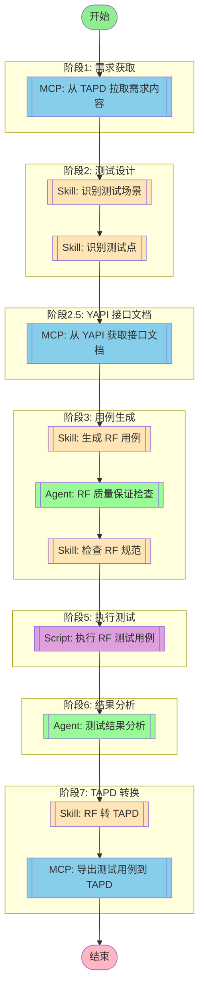

# RF 执行能力 Implementation Plan

> **For agentic workers:** REQUIRED SUB-SKILL: Use superpowers:subagent-driven-development (recommended) or superpowers:executing-plans to implement this plan task-by-task. Steps use checkbox (`- [ ]`) syntax for tracking.

**Goal:** 为 rf-testing-plugin 添加 Robot Framework 测试用例执行能力，支持自动检测 Python 3.7+ 环境、执行测试、解析结果并集成到现有工作流中。

**Architecture:** 四个独立 Python 模块（runner、listener、parser、executor）职责分离，通过调用 python_detector.py 检测环境，使用 robotframework 原生命令执行测试，解析 output.xml 生成结构化 JSON 结果。

**Tech Stack:** Python 3.7+, Robot Framework 3.2.2+, xmltodict, argparse, subprocess

---

## File Structure

| 文件 | 类型 | 职责 |
|------|------|------|
| `03-scripts/rf_listener.py` | 新建 | 捕获 Robot Framework 执行事件，实时输出进度 |
| `03-scripts/rf_parser.py` | 新建 | 解析 output.xml，提取测试结果和统计信息 |
| `03-scripts/rf_runner.py` | 新建 | 命令行入口，构建 robot 命令，调用执行器 |
| `03-scripts/rf_executor.py` | 新建 | 整合 runner、listener、parser，提供统一执行接口 |
| `05-plugins/rf-testing/workflows/full-test-pipeline.md` | 修改 | 新增阶段 2.5 和阶段 5 |

---

## Task 1: rf_listener.py - Robot Framework 事件监听器

**Files:**
- Create: `03-scripts/rf_listener.py`

- [ ] **Step 1: 创建文件和基础类结构**

```python
# -*- coding: utf-8 -*-
"""
Robot Framework 事件监听器
捕获测试执行事件并实时输出进度
"""
import sys
from typing import Any, Dict
from datetime import datetime


class RFListener:
    """Robot Framework 事件监听器"""

    def __init__(self, verbose: bool = True):
        """
        初始化监听器

        Args:
            verbose: 是否输出详细日志
        """
        self.verbose = verbose
        self.test_count = 0
        self.pass_count = 0
        self.fail_count = 0
        self.skip_count = 0
        self.start_time = None

    def start_suite(self, name: str, attrs: Dict[str, Any]) -> None:
        """测试套件开始"""
        if self.verbose:
            print(f"\n{'='*60}")
            print(f"Suite: {name}")
            print(f"{'='*60}")

    def end_suite(self, name: str, attrs: Dict[str, Any]) -> None:
        """测试套件结束"""
        if self.verbose:
            duration = attrs.get('elapsedtime', 0) / 1000
            print(f"\nSuite {name} completed in {duration:.2f}s")

    def start_test(self, name: str, attrs: Dict[str, Any]) -> None:
        """测试用例开始"""
        if self.verbose:
            print(f"\n[Test] {name} ...", end="", flush=True)

    def end_test(self, name: str, attrs: Dict[str, Any]) -> None:
        """测试用例结束"""
        self.test_count += 1
        status = attrs.get('status', 'UNKNOWN')

        if status == 'PASS':
            self.pass_count += 1
            if self.verbose:
                print(f" \033[92mPASS\033[0m ({attrs.get('elapsedtime', 0)/1000:.2f}s)")
        elif status == 'FAIL':
            self.fail_count += 1
            if self.verbose:
                print(f" \033[91mFAIL\033[0m ({attrs.get('elapsedtime', 0)/1000:.2f}s)")
                message = attrs.get('message', '')
                if message:
                    print(f"  Error: {message}")
        elif status == 'SKIP':
            self.skip_count += 1
            if self.verbose:
                print(f" \033[93mSKIP\033[0m")

    def start_keyword(self, name: str, attrs: Dict[str, Any]) -> None:
        """关键字开始"""
        pass

    def end_keyword(self, name: str, attrs: Dict[str, Any]) -> None:
        """关键字结束"""
        pass

    def log_message(self, message: Dict[str, Any]) -> None:
        """日志消息"""
        if self.verbose and message.get('level') == 'FAIL':
            print(f"  [LOG] {message.get('message', '')}")

    def close(self) -> None:
        """关闭监听器"""
        if self.verbose:
            print(f"\n{'='*60}")
            print(f"Summary: {self.pass_count} passed, {self.fail_count} failed, {self.skip_count} skipped")
            print(f"{'='*60}\n")
```

- [ ] **Step 2: 提交代码**

```bash
git add 03-scripts/rf_listener.py
git commit -m "feat: add RF listener for capturing execution events"
```

---

## Task 2: rf_parser.py - 结果解析模块

**Files:**
- Create: `03-scripts/rf_parser.py`

- [ ] **Step 1: 创建文件和基础解析函数**

```python
# -*- coding: utf-8 -*-
"""
Robot Framework 结果解析模块
解析 output.xml 文件，提取测试结果和统计信息
"""
import xml.etree.ElementTree as ET
from typing import Dict, List, Any
from datetime import datetime


def parse_robot_output(output_file: str) -> Dict[str, Any]:
    """
    解析 Robot Framework 输出文件

    Args:
        output_file: output.xml 文件路径

    Returns:
        包含统计信息和测试结果的结构化数据
    """
    try:
        tree = ET.parse(output_file)
        root = tree.getroot()
    except Exception as e:
        return {
            "error": f"Failed to parse XML: {str(e)}",
            "statistics": {"total": 0, "passed": 0, "failed": 0, "skipped": 0},
            "tests": []
        }

    # 解析统计信息
    statistics = _parse_statistics(root)

    # 解析测试用例
    tests = _parse_tests(root)

    return {
        "statistics": statistics,
        "tests": tests,
        "suites": _parse_suites(root)
    }


def _parse_statistics(root: ET.Element) -> Dict[str, Any]:
    """解析统计信息"""
    total = 0
    passed = 0
    failed = 0
    skipped = 0
    duration = 0.0

    for stat in root.findall('.//stat'):
        status = stat.get('pass', '')
        if status == 'PASS':
            passed += int(stat.get('value', '0'))
        elif status == 'FAIL':
            failed += int(stat.get('value', '0'))
        elif status == 'SKIP':
            skipped += int(stat.get('value', '0'))

    total = passed + failed + skipped

    # 获取总耗时
    elapsed_elem = root.find('.//statistics/total/elapsedtime')
    if elapsed_elem is not None:
        duration = int(elapsed_elem.get('value', '0')) / 1000.0

    return {
        "total": total,
        "passed": passed,
        "failed": failed,
        "skipped": skipped,
        "duration": duration
    }


def _parse_tests(root: ET.Element) -> List[Dict[str, Any]]:
    """解析所有测试用例"""
    tests = []

    for test in root.findall('.//test'):
        test_data = {
            "name": test.get('name', ''),
            "status": test.get('status', 'UNKNOWN'),
            "duration": int(test.get('elapsedtime', '0')) / 1000.0,
            "tags": [tag.get('name', '') for tag in test.findall('tag')],
            "doc": test.get('doc', ''),
            "message": ''
        }

        # 获取失败消息
        if test_data["status"] == 'FAIL':
            msg_elem = test.find('status/message')
            if msg_elem is not None:
                test_data["message"] = msg_elem.text or ''

        tests.append(test_data)

    return tests


def _parse_suites(root: ET.Element) -> List[Dict[str, Any]]:
    """解析测试套件"""
    suites = []

    for suite in root.findall('.//suite'):
        suite_data = {
            "name": suite.get('name', ''),
            "source": suite.get('source', ''),
            "status": suite.get('status', 'UNKNOWN'),
            "duration": int(suite.get('elapsedtime', '0')) / 1000.0
        }
        suites.append(suite_data)

    return suites
```

- [ ] **Step 2: 提交代码**

```bash
git add 03-scripts/rf_parser.py
git commit -m "feat: add RF output parser for extracting test results"
```

---

## Task 3: rf_runner.py - 执行脚本入口

**Files:**
- Create: `03-scripts/rf_runner.py`

- [ ] **Step 1: 创建文件和命令行参数解析**

```python
# -*- coding: utf-8 -*-
"""
Robot Framework 执行脚本入口
支持命令行参数，构建并执行 robot 命令
"""
import argparse
import subprocess
import sys
import os
from typing import Dict, List, Optional
from pathlib import Path

# 添加 scripts 目录到 Python 路径
SCRIPT_DIR = Path(__file__).parent
sys.path.insert(0, str(SCRIPT_DIR))

from python_detector import detect_python_environments


def build_robot_command(
    robot_file: str,
    python_path: str = None,
    test_name: str = None,
    suite_name: str = None,
    include_tags: List[str] = None,
    exclude_tags: List[str] = None,
    variables: List[str] = None,
    variable_file: str = None,
    output_dir: str = "./output",
    log_level: str = "INFO",
    listener: str = None
) -> List[str]:
    """
    构建 robot 命令

    Args:
        robot_file: .robot 文件路径
        python_path: Python 可执行文件路径
        test_name: 指定测试用例名称
        suite_name: 指定测试套件名称
        include_tags: 包含的标签列表
        exclude_tags: 排除的标签列表
        variables: 变量列表 [KEY:VAL, ...]
        variable_file: 变量文件路径
        output_dir: 输出目录
        log_level: 日志级别
        listener: listener 脚本路径

    Returns:
        robot 命令列表
    """
    cmd = [python_path or sys.executable, "-m", "robot"]

    # 添加 listener
    if listener:
        cmd.extend(["--listener", listener])

    # 添加日志级别
    cmd.extend(["--loglevel", log_level])

    # 添加输出目录
    cmd.extend(["--outputdir", output_dir])

    # 添加测试用例过滤
    if test_name:
        cmd.extend(["--test", test_name])
    if suite_name:
        cmd.extend(["--suite", suite_name])

    # 添加标签过滤
    if include_tags:
        for tag in include_tags:
            cmd.extend(["--include", tag])
    if exclude_tags:
        for tag in exclude_tags:
            cmd.extend(["--exclude", tag])

    # 添加变量
    if variables:
        for var in variables:
            cmd.extend(["--variable", var])
    if variable_file:
        cmd.extend(["--variablefile", variable_file])

    # 添加 .robot 文件路径
    cmd.append(robot_file)

    return cmd


def run_robot_command(cmd: List[str]) -> Dict[str, Any]:
    """
    执行 robot 命令

    Args:
        cmd: robot 命令列表

    Returns:
        执行结果字典
    """
    result = {
        "success": False,
        "exit_code": 1,
        "stdout": "",
        "stderr": "",
        "error": None
    }

    try:
        process = subprocess.Popen(
            cmd,
            stdout=subprocess.PIPE,
            stderr=subprocess.PIPE,
            text=True
        )
        stdout, stderr = process.communicate()

        result["exit_code"] = process.returncode
        result["stdout"] = stdout
        result["stderr"] = stderr

        # Robot Framework 返回码 0 表示所有通过，其他表示有失败
        result["success"] = process.returncode == 0

    except FileNotFoundError as e:
        result["error"] = f"Python not found: {e}"
    except Exception as e:
        result["error"] = str(e)

    return result


def detect_python_for_execution(python_path: Optional[str] = None) -> Optional[str]:
    """
    检测或验证 Python 环境

    Args:
        python_path: 用户指定的 Python 路径

    Returns:
        有效的 Python 路径，或 None
    """
    if python_path:
        # 验证用户指定的路径
        if os.path.exists(python_path):
            return python_path
        return None

    # 自动检测
    envs = detect_python_environments()
    if envs:
        # 优先选择第一个（根据 python_detector 的排序逻辑）
        return envs[0]["python_path"]

    return None


def parse_args():
    """解析命令行参数"""
    parser = argparse.ArgumentParser(
        description="Robot Framework Test Runner"
    )
    parser.add_argument(
        "robot_file",
        help="Robot Framework test file (.robot)"
    )
    parser.add_argument(
        "--python",
        help="Python executable path"
    )
    parser.add_argument(
        "--test",
        help="Execute specific test"
    )
    parser.add_argument(
        "--suite",
        help="Execute specific suite"
    )
    parser.add_argument(
        "--include",
        action="append",
        help="Include tests by tag"
    )
    parser.add_argument(
        "--exclude",
        action="append",
        help="Exclude tests by tag"
    )
    parser.add_argument(
        "--variable",
        action="append",
        help="Set variable (KEY:VAL)"
    )
    parser.add_argument(
        "--variablefile",
        help="Load variables from file"
    )
    parser.add_argument(
        "--outputdir",
        default="./output",
        help="Output directory"
    )
    parser.add_argument(
        "--loglevel",
        default="INFO",
        choices=["TRACE", "DEBUG", "INFO", "WARN", "NONE"],
        help="Log level"
    )
    parser.add_argument(
        "--listener",
        default=None,
        help="Listener script path"
    )

    return parser.parse_args()


def main():
    """主函数"""
    args = parse_args()

    # 验证 .robot 文件存在
    if not os.path.exists(args.robot_file):
        print(f"Error: Robot file not found: {args.robot_file}", file=sys.stderr)
        sys.exit(1)

    # 检测 Python 环境
    python_path = detect_python_for_execution(args.python)
    if not python_path:
        print("Error: No valid Python environment found", file=sys.stderr)
        sys.exit(1)

    # 默认使用内置 listener
    listener_path = args.listener or str(SCRIPT_DIR / "rf_listener.py")

    # 构建 robot 命令
    cmd = build_robot_command(
        robot_file=args.robot_file,
        python_path=python_path,
        test_name=args.test,
        suite_name=args.suite,
        include_tags=args.include,
        exclude_tags=args.exclude,
        variables=args.variable,
        variable_file=args.variablefile,
        output_dir=args.outputdir,
        log_level=args.loglevel,
        listener=listener_path
    )

    # 执行命令
    result = run_robot_command(cmd)

    if result["error"]:
        print(f"Error: {result['error']}", file=sys.stderr)
        sys.exit(1)

    if result["stderr"]:
        print(result["stderr"], file=sys.stderr)

    sys.exit(result["exit_code"])


if __name__ == "__main__":
    main()
```

- [ ] **Step 2: 提交代码**

```bash
git add 03-scripts/rf_runner.py
git commit -m "feat: add RF runner with CLI support"
```

---

## Task 4: rf_executor.py - 执行器封装

**Files:**
- Create: `03-scripts/rf_executor.py`

- [ ] **Step 1: 创建文件和执行器类**

```python
# -*- coding: utf-8 -*-
"""
Robot Framework 执行器
整合 runner、listener、parser，提供统一执行接口
"""
import os
from typing import Dict, List, Optional, Any
from pathlib import Path

# 添加 scripts 目录到 Python 路径
SCRIPT_DIR = Path(__file__).parent
import sys
sys.path.insert(0, str(SCRIPT_DIR))

from rf_runner import build_robot_command, run_robot_command, detect_python_for_execution
from rf_parser import parse_robot_output


class RFExecutor:
    """Robot Framework 执行器"""

    def __init__(self, python_path: Optional[str] = None):
        """
        初始化执行器

        Args:
            python_path: 指定 Python 环境路径
        """
        self.python_path = detect_python_for_execution(python_path)
        if not self.python_path:
            raise RuntimeError("No valid Python environment found")

        self.listener_path = str(SCRIPT_DIR / "rf_listener.py")

    def execute(
        self,
        robot_file: str,
        test_name: str = None,
        suite_name: str = None,
        include_tags: List[str] = None,
        exclude_tags: List[str] = None,
        variables: List[str] = None,
        variable_file: str = None,
        output_dir: str = "./output",
        log_level: str = "INFO"
    ) -> Dict[str, Any]:
        """
        执行 Robot Framework 测试

        Args:
            robot_file: .robot 文件路径
            test_name: 执行指定测试用例
            suite_name: 执行指定测试套件
            include_tags: 包含的标签
            exclude_tags: 排除的标签
            variables: 变量列表
            variable_file: 变量文件
            output_dir: 输出目录
            log_level: 日志级别

        Returns:
            执行结果字典
        """
        # 验证文件存在
        if not os.path.exists(robot_file):
            return {
                "success": False,
                "error": f"Robot file not found: {robot_file}",
                "statistics": {"total": 0, "passed": 0, "failed": 0, "skipped": 0},
                "tests": []
            }

        # 构建命令
        cmd = build_robot_command(
            robot_file=robot_file,
            python_path=self.python_path,
            test_name=test_name,
            suite_name=suite_name,
            include_tags=include_tags,
            exclude_tags=exclude_tags,
            variables=variables,
            variable_file=variable_file,
            output_dir=output_dir,
            log_level=log_level,
            listener=self.listener_path
        )

        # 执行命令
        cmd_result = run_robot_command(cmd)

        if cmd_result["error"]:
            return {
                "success": False,
                "error": cmd_result["error"],
                "statistics": {"total": 0, "passed": 0, "failed": 0, "skipped": 0},
                "tests": []
            }

        # 解析输出文件
        output_file = os.path.join(output_dir, "output.xml")

        if not os.path.exists(output_file):
            return {
                "success": cmd_result["success"],
                "error": "output.xml not generated",
                "statistics": {"total": 0, "passed": 0, "failed": 0, "skipped": 0},
                "tests": []
            }

        # 解析结果
        parsed = parse_robot_output(output_file)

        return {
            "success": cmd_result["success"],
            "exit_code": cmd_result["exit_code"],
            "output_dir": output_dir,
            "log_file": os.path.join(output_dir, "log.html"),
            "report_file": os.path.join(output_dir, "report.html"),
            "output_file": output_file,
            "python_path": self.python_path,
            "statistics": parsed.get("statistics", {}),
            "tests": parsed.get("tests", []),
            "suites": parsed.get("suites", [])
        }


def execute_robot_test(
    robot_file: str,
    python_path: str = None,
    **kwargs
) -> Dict[str, Any]:
    """
    便捷函数：执行 Robot Framework 测试

    Args:
        robot_file: .robot 文件路径
        python_path: Python 环境路径
        **kwargs: 其他执行参数

    Returns:
        执行结果字典
    """
    executor = RFExecutor(python_path=python_path)
    return executor.execute(robot_file, **kwargs)
```

- [ ] **Step 2: 提交代码**

```bash
git add 03-scripts/rf_executor.py
git commit -m "feat: add RF executor with unified interface"
```

---

## Task 5: 更新 full-test-pipeline.md 工作流

**Files:**
- Modify: `05-plugins/rf-testing/workflows/full-test-pipeline.md`

- [ ] **Step 1: 更新流程图，添加两个新阶段**

```markdown

```

- [ ] **Step 2: 添加 YAPI MCP 节点定义**

在 MCP 工具节点部分添加：

```markdown
#### mcp_yapi(MCP 自动选择) - AI 工具选择模式

<!-- MCP_NODE_METADATA: {"mode":"aiToolSelection","serverId":"yapi-auto-mcp","userIntent":"根据需求中的接口名称，从 YAPI 获取接口文档。\n提取接口的请求参数、响应格式、示例数据等。"} -->

**MCP 服务器**: yapi-auto-mcp

**验证状态**: 有效

**用户意图（自然语言任务描述）**:

```
根据需求中的接口名称，从 YAPI 获取接口文档。
提取接口的请求参数、响应格式、示例数据等。
```

**执行方法**:

Claude Code 应分析上述任务描述，在运行时查询 MCP 服务器 "yapi-auto-mcp" 获取当前工具列表。然后，选择最合适的工具，并根据任务要求确定适当的参数值。
```

- [ ] **Step 3: 添加 RF 执行脚本节点定义**

在技能节点后添加：

```markdown
### 脚本节点

#### script_execute(执行 RF 测试用例)

- **脚本**: `03-scripts/rf_executor.py`
- **函数**: `execute_robot_test()`
- **职责**: 执行生成的 RF 测试用例，返回执行结果
- **参数**:
  - `robot_file`: .robot 文件路径
  - `python_path`: Python 环境路径（可选，自动检测）
  - `test_name`: 执行指定测试用例（可选）
  - `suite_name`: 执行指定测试套件（可选）
  - `output_dir`: 输出目录（默认: ./output）
- **返回值**:
  - `success`: 执行是否成功
  - `statistics`: 统计信息（总数/通过/失败/跳过）
  - `tests`: 测试用例列表
  - `log_file`: HTML 日志文件路径
  - `report_file`: HTML 报告文件路径
```

- [ ] **Step 4: 更新执行流程描述**

将原执行流程改为：

```markdown
### 执行流程

1. **需求获取** - 从 TAPD 拉取需求内容
2. **测试设计** - 识别测试场景和测试点
3. **接口文档** - 从 YAPI 获取接口文档（新增）
4. **用例生成** - 生成符合 RF 规范的测试用例
5. **质量保证** - RF 质量保证 Agent 检查用例质量
6. **规范检查** - 检查生成的用例是否符合编写规范
7. **执行测试** - 执行 RF 测试用例并验证（新增）
8. **结果分析** - 测试结果分析 Agent 分析质量指标
9. **TAPD 转换** - 将 RF 用例转换为 TAPD 格式
10. **导出上传** - 将测试用例导出并上传到 TAPD
```

- [ ] **Step 5: 更新输出结果**

在输出结果中添加：

```markdown
### 输出结果

- RF 用例文件（.robot）
- 质量保证报告
- 规范检查报告
- **测试执行报告**（新增）
- **HTML 日志和报告**（新增）
- 测试结果分析报告
- TAPD Excel 文件
- 导出结果统计
```

- [ ] **Step 6: 提交更改**

```bash
git add 05-plugins/rf-testing/workflows/full-test-pipeline.md
git commit -m "feat: add YAPI fetch and RF execute stages to workflow"
```

---

## Self-Review Checklist

- [x] **Spec coverage**:
  - [x] rf_listener.py - Task 1
  - [x] rf_parser.py - Task 2
  - [x] rf_runner.py - Task 3
  - [x] rf_executor.py - Task 4
  - [x] 工作流更新 - Task 5

- [x] **Placeholder scan**:
  - [x] 无 "TBD" 或 "TODO"
  - [x] 无 "添加适当的错误处理"
  - [x] 所有步骤包含具体代码

- [x] **Type consistency**:
  - [x] 函数名称一致
  - [x] 参数名称一致
  - [x] 返回值结构一致