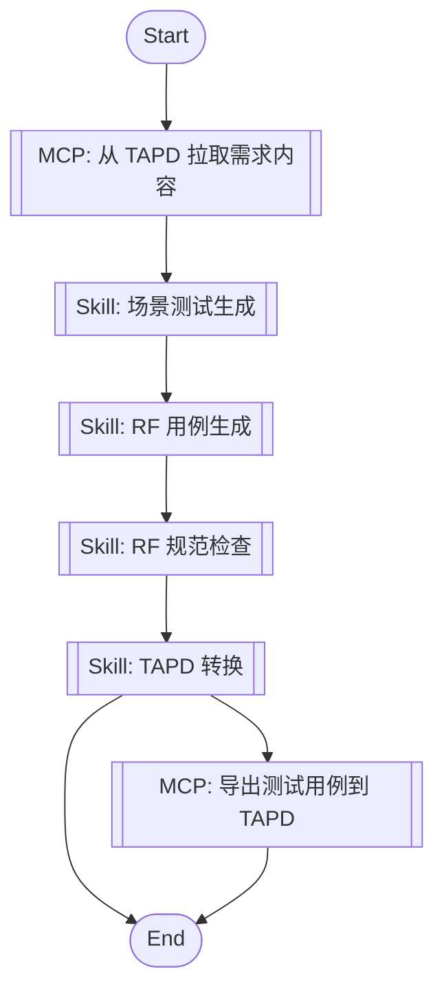

# Robot Framework 测试插件设计文档

**日期**: 2026-04-01
**对标**: AI-First 开发插件架构
**目标**: 将现有 Robot Framework 测试相关资产重构为 Claude/LLM 可用插件

---

## 1. 项目背景

### 1.1 现状

现有项目 `rf_plugin_for_claude` 包含：
- 详细的 Robot Framework 编写规范（`robotframeworkruls.mdc`）
- RF 用例转 TAPD Excel 的转换脚本
- 多个 testing 相关技能文件
- 部分与测试无关的冗余内容

### 1.2 目标

重构为一个符合 **AI-First 插件标准**的 RF 测试插件，核心能力：

1. 基于 Robot Framework 框架，帮助用户编写、维护自动化测试用例
2. 将 RF 用例转换为 TAPD 等测试管理平台可导入格式
3. 对标开发工作流，在「需求→用例→TAPD」闭环中提供测试工程师视角的能力

### 1.3 架构对齐

遵循 **AI-First 插件标准**：
- ✅ Claude Plugin 元数据格式（`.claude-plugin/marketplace.json` + `plugin.json`）
- ✅ Mermaid flowchart 工作流编排
- ✅ 统一交互协议（INTERACTION_PROTOCOL.md）
- ✅ SKILL.md 格式的技能定义
- ✅ jl-skills 公共库（指令/规范/模板）
- ✅ MCP Task 集成（TAPD）

### 1.4 约束

- **可移植性**：避免硬编码绝对路径，减少对特定环境的依赖
- **可扩展性**：预留扩展点，支持未来添加更多测试策略、脚本、平台适配器
- **通用性**：不仅 Claude 可用，其他 Agent/LLM 也能调用
- **对标开发插件**：保持相同的交互体验和工作流风格

---

## 2. 架构设计

### 2.1 核心设计理念

**对标开发工作流 + Skill 链式架构**

```
TAPD 需求 → [场景测试生成] → RF用例 → [规范检查] → TAPD 转换
                                    ↓                    ↓
                                 [自动化验证]            [导出]
```

- 基于 Mermaid flowchart 编排工作流
- 支持 Skill 节点和 MCP Task 节点组合
- 严格遵循交互协议（单步输出、阶段写入）
- 支持 TAPD MCP 双向集成（拉取需求、导出用例）

### 2.2 目录结构（AI-First 标准）

```
rf-testing-plugin/
├── .claude-plugin/                   # Claude Plugin 元数据
│   ├── marketplace.json               # Marketplace 注册信息
│   └── plugin.json                    # Plugin Plugin 基础信息
│
├── 00-JL-Skills/                     # JL 公共库（必须完整拷贝）
│   └── jl-skills/                    # 全局公共支撑库
│       ├── instructions/             # 交互协议指令
│       │   ├── INTERACTION_PROTOCOL.md
│       │   └── test/                 # 测试相关指令
│       │       ├── scenario-identification-instructions.md
│       │       ├── script-generation-instructions.md
│       │       └── report-generation-instructions.md
│       ├── specs/                    # 规范文档
│       │   ├── Robot Framework 编写规范.md
│       │   ├── JSONPath 使用指南.md
│       │   └── 测试设计模式.md
│       └── templates/                # 模板文件
│           ├── JL-Template-RF-TestCase.md
│           ├── JL-Template-RF-Keyword.md
│           └── JL-Template-TAPD-Report.md
│
├── 01-RF-Skills/                     # RF 测试技能集合
│   └── skills/                       # 技能定义（SKILL.md 格式）
│       ├── test/                     # 场景测试生成技能
│       │   └── SKILL.md
│       ├── rf-standards-check/       # RF 规范检查技能
│       │   └── SKILL.md
│       └── tapd-conversion/          # TAPD 转换技能
│           ├── SKILL.md
│           └── references/           # 自包含引用
│               └── TAPD_spec.md
│
├── 02-workflows/                     #` 工作流定义（Mermaid flowchart）
│   ├── requirement-to-rf.md           # 需求 → RF 用例
│   ├── rf-to-tapd.md                  # RF 用例 → TAPD
│   └── full-test-pipeline.md          # 完整测试流程
│
├── 03-scripts/                       # 实用脚本
│   ├── robot2tapd.py                  # 转换脚本（增强版）
│   └── batch_convert.sh               # 批量转换
│
├── 04-cases/                         # 使用案例
│   └── README.md
│
└── README.md                          # 插件说明
```

**关键说明**：
- `jl-skills/` 是全局公共库，必须与 skills 目录同级
- 每个技能目录包含 `SKILL.md` 和可选的 `references/` 自包含引用
- 工作流使用 Mermaid flowchart 格式，支持 Skill 和 MCP 节点编排
- 插件通过 `.claude-plugin/` 目录进行注册和配置

---

## 3. 核心组件（AI-First 标准）

### 3.1 Plugin 元数据

```json
// .claude-plugin/marketplace.json
{
  "name": "rf-testing-plugin",
  "owner": {
    "name": "your-name"
  },
  "metadata": {
    "description": "Robot Framework 测试用例生成与转换插件，对标开发工作流提供测试工程师视角能力。",
    "version": "1.0.0"
  },
  "plugins": [
    {
      "name": "rf-test-workflow",
      "source": "./00-JL-Skills",
      "description": "根据 TAPD 需求自动生成 RF 用例并转换为 TAPD 格式，对标开发工作流的测试闭环。",
      "version": "1.0.0",
      "author": {
        "name": "your-name"
      },
      "category": "testing",
      "tags": [
        "robotframework",
        "tapd",
        "test-automation",
        "workflow"
      ]
    }
  ]
}
```

```json
// .claude-plugin/plugin.json
{
    "name": "rf-test-workflow",
    "description": "基于 TAPD 需求的 RF 测试工作流插件，联动 TAPD MCP。",
    "version": "1.0.0",
    "author": {
        "name": "your-name"
    },
    "license": "MIT",
    "keywords": [
        "claude-code",
        "robotframework",
        "tapd",
        "test-automation"
    ]
}
```

### 3.2 工作流编排（Mermaid Flowchart）



### 3.3 技能定义（SKILL.md 格式）

每个技能遵循 AI-First 标准：

```markdown
---
name: test
description: 场景测试生成技能，根据需求生成 RF 测试用例
alwaysApply: false
---

# 场景测试生成

## 初始化检查

[遵循 INTERACTION_PROTOCOL.md 的初始化检查模板]

## 流程

### 阶段1：需求分析

[步骤输出格式]
[确认点]

### 阶段2：测试点识别

[步骤输出格式]
[确认点]

### 阶段3：RF 用例生成

[步骤输出格式]
[确认点]

### 阶段4：规范检查

[步骤输出格式]
[确认点]

### 阶段5：TAPD 转换

[步骤输出格式]
[确认点]
```

### 3.4 MCP 集成

**TAPD MCP 用途**：
1. 从 TAPD 需求链接拉取需求内容
2. 导出测试用例到 TAPD（创建或更新）

**MCP Task 定义**：

```yaml
mcp-tapd-fetch:
    description: 根据需求链接从 TAPD 拉取需求内容
    server: tapd
    workspace_id: 48200023
    input:
        requirement_url: string
    output:
        requirement_id: string
        requirement_content: object
        service_name: string

mcp-tapd-export:
    description: 导出测试用例到 TAPD
    server: tapd
    workspace_id: 48200023
    input:
        test_cases: array
        requirement_id: string
    output:
        export_result: object
```

---

## 4. 文件迁移计划

### 4.1 保留并迁移的文件

| 原文件 | 目标位置 | 处理方式 |
|--------|----------|----------|
| `robotframeworkruls.mdc` | `00-JL-Skills/jl-skills/specs/Robot Framework 编写规范.md` | 拆分保留，提取为多个 MD |
| `robot2excel_tapd_base64.py` | `03-scripts/robot2tapd.py` | 增强封装，增加错误处理和日志 |
| `rf-jsonpath.md` | `00-JL-Skills/jl-skills/specs/JSONPath 使用指南.md` | 保留 |
| `rf-keywords.md` | `00-JL-Skills/jl-skills/specs/` | 保留，合并到规范文档 |
| `rf-variables.md` | `00-JL-Skills/jl-skills/specs/` | 保留，合并到规范文档 |
| `rf-basics.md` | `00-JL-Skills/jl-skills/specs/` | 保留 |
| `testing-capabilities.md` | `00-JL-Skills/jl-skills/specs/测试设计模式.md` | 保留 |
| `requirement-to-testcase.yaml` | `02-workflows/requirement-to-rf.md` | 转换为 Mermaid flowchart |
| `bug-lifecycle.md` | `00-JL-Skills/jl-skills/instructions/test/` | 转换为指令文件 |
| `SKILL.md` (testing) | 拆分到 `01-RF-Skills/skills/` | 按任务维度拆分 |
| `SKILL.md` (requirements-analysis) | `01-RF-Skills/skills/test/SKILL.md` | 保留，合并测试分析逻辑 |
| `SKILL.md` (test-case-generation) | `01-RF-Skills/skills/test/SKILL.md` | 保留，合并生成逻辑 |

### 4.2 删除的文件

| 文件 | 删除原因 |
|------|----------|
| `evomap.md` | 与 RF 测试无关 |
| `self-improvement.md` | 与 RF 测试无关 |
| `multi_agent_workflow.py` | 通用编排，非测试专用 |
| `__init__.py` | Python 包化不需要 |
| `prompts/` 目录 | 原有内容通用性弱，重新设计 |
| `assets/` 目录整体 | 迁移到新目录结构 |

### 4.3 新增的文件

| 文件 | 用途 |
|------|------|
| `.claude-plugin/marketplace.json` | Claude Plugin 市场注册 |
| `.claude-plugin/plugin.json` | Plugin Plugin 信息 |
| `00-JL-Skills/jl-skills/instructions/INTERACTION_PROTOCOL.md` | 复用 AI-First 交互协议 |
| `02-workflows/full-test-pipeline.md` | 完整测试流程定义 |
| `04-cases/README.md` | 使用案例说明 |

---

## 5. 标准工作流

### 5.1 完整流程（对标开发工作流）

| 开发阶段 | 测试插件介入点 | 输出 |
|----------|----------------|------|
| 分析需求 | 从 TAPD 拉取需求，识别测试点 | 测试点列表 |
| 方案思考与计划 | 基于测试点生成 RF 用例骨架 | RF 用例文件 |
| TDD | 检查 RF 规范，提供模板和示例 | 规范报告、用例代码 |
| 代码评审 | 审查用例覆盖率、边界场景 | 质量建议 |
| 收尾与交付 | 批量导出到 TAPD，输出测试报告 | TAPD Excel、测试报告 |

### 5.2 预定义工作流

| 工作流 | 用途 | Mermaid Flowchart |
|--------|------|-----------------|
| `full-test-pipeline.md` | 完整流程 | TAPD 需求 → RF 用例 → 规范检查 → TAPD 导出 |
| `requirement-to-rf.md` | 需求转用例 | TAPD 需求 → RF 用例生成 |
| `rf-to-tapd.md` | 仅转换 | RF 用例 → TAPD 导出 |

---

## 6. 使用方式

### 6.1 Claude 集成

```json
// Claude settings.json
{
  "skills": [
    {
      "name": "rf-test-workflow",
      "path": "01-RF-Skills/skills/test/SKILL.md"
    }
  ]
}
```

### 6.2 命令触发

```bash
# 完整测试流程
/rf-test-workflow

# 仅规范检查
/rf-standards-check

# TAPD 转换
/rf-tapd-conversion
```

### 6.3 其他 Agent 集成

复制以下目录结构到目标项目：
- `00-JL-Skills/` （完整拷贝）
- `01-RF-Skills/`

然后在 Agent 的技能系统中引用相应的 SKILL.md 文件。

---

## 7. 依赖管理

```bash
# Python 依赖
pip install pandas openpyxl robotframework

# MCP 依赖（Claude Code）
- TAPD MCP Server（需单独部署）
```

---

## 8. 成功标准

- [ ] 目录结构符合 AI-First 标准
- [ ] 包含 `.claude-plugin/` 元数据
- [ ] 工作流使用 Mermaid flowchart
- [ ] 技能遵循 SKILL.md 格式和交互协议
- [ ] `jl-skills/` 公共库完整
- [ ] TAPD MCP 集成点定义
- [ ] 所有 RF 相关资产正确迁移
- [ ] 转换脚本增强完成
- [ ] README 包含完整使用说明
