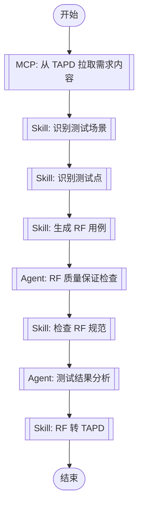

# rf-testing 插件重构设计文档

**日期**: 2026-04-01
**目标**: 对标 ai-first-master 的 auto-develop 插件结构，将 rf-testing-plugin 重构为符合 AI-First 标准的独立插件

## 背景与动机

当前 rf-testing-plugin 项目对标 `D:\workspace\python\ai-first-master\ai-first-master\05-plugins\auto-develop` 进行开发，但缺少以下关键组件：

1. **MCP 配置** (`.mcp.json`)：缺少插件级的 TAPD 和 GitLab MCP 配置
2. **独立插件目录**：缺少 `05-plugins/rf-testing/` 独立插件目录结构
3. **入口命令**：缺少 `commands/start.md` 定义的命令行入口
4. **MCP 节点定义**：工作流中缺少详细的 MCP 节点定义（serverId 和 userIntent）

参考项目采用清晰的插件边界和标准化的配置管理，便于维护和扩展。

## 设计方案

### 目录结构重构

```
rf-testing-plugin/
├── 00-JL-Skills/                      # JL 公共库（保持不变）
├── 01-RF-Skills/                      # RF 技能（保持不变）
├── 02-agents/                         # 测试 agents（新增）
│   └── testing-rf-quality-assurance.md
├── 03-scripts/                        # 脚本和资源
│   ├── JLTestLibrary.zip            # Robot Framework 自定义测试库
│   ├── robot2tapd.py
│   └── batch_convert.sh
├── 04-cases/                          # 用例（保持不变）
├── 05-plugins/                        # 插件目录（新增）
│   └── rf-testing/                    # 独立插件目录
│       ├── workflows/
│       │   ├── full-test-pipeline.md  # 完整测试流程
│       │   ├── requirement-to-rf.md   # 需求转用例
│       │   └── rf-to-tapd.md          # RF转TAPD
│       ├── commands/
│       │   └── start.md               # 入口命令
│       ├── .claude-plugin/
│       │   └── plugin.json            # 插件清单
│       ├── .mcp.json                  # MCP配置
│       └── README.md                  # 插件说明
├── docs/                              # 文档（保持不变）
├── .gitignore                          # Git忽略配置（保持不变）
├── .claude-plugin/
│   └── marketplace.json               # 仓库级marketplace
├── README.md                          # 更新说明
└── install.sh / install.bat           # 安装脚本
```

### 核心变更

#### 1. 新增插件目录 `05-plugins/rf-testing/`

对标参考项目结构，创建独立插件目录，包含：
- `workflows/`: 工作流定义（Mermaid flowchart + MCP 节点）
- `commands/`: 入口命令定义
- `.claude-plugin/plugin.json`: 插件元数据
- `.mcp.json`: MCP 服务器配置
- `README.md`: 插件使用说明

#### 2. MCP 配置

```json
{
  "mcpServers": {
    "tapd": {
      "command": "uvx",
      "args": ["mcp-server-tapd"],
      "env": {
        "TAPD_ACCESS_TOKEN": "${TAPD_ACCESS_TOKEN}",
        "TAPD_API_BASE_URL": "https://api.tapd.cn",
        "TAPD_BASE_URL": "https://www.tapd.cn",
        "BOT_URL": ""
      }
    },
    "gitlab": {
      "command": "cmd",
      "args": [
        "/c",
        "npx",
        "-y",
        "@modelcontextprotocol/server-gitlab"
      ],
      "env": {
        "GITLAB_API_URL": "${GITLAB_API_URL}",
        "GITLAB_PERSONAL_ACCESS_TOKEN": "${GITLAB_PERSONAL_ACCESS_TOKEN}"
      }
    }
  }
}
```

**环境变量要求**：
- `TAPD_ACCESS_TOKEN`：必需
- `GITLAB_API_URL`：可选，如需 GitLab 支持
- `GITLAB_PERSONAL_ACCESS_TOKEN`：可选，如需 GitLab 支持

#### 3. 插件元数据

```json
{
  "name": "rf-testing",
  "description": "基于 TAPD 需求的 Robot Framework 测试用例生成与转换插件，提供完整测试工作流。",
  "version": "1.0.0",
  "author": {
    "name": "JoeyTrribbiani"
  },
  "license": "MIT",
  "keywords": [
    "claude-code",
    "robotframework",
    "tapd",
    "gitlab",
    "testing",
    "automation"
  ]
}
```

#### 4. 入口命令

**命令**: `/rf-testing:start [tapd-link]`

**文件**: `05-plugins/rf-testing/commands/start.md`

**行为**：
- 如果传入参数，直接作为 TAPD 需求链接
- 如果没有参数，向用户索要 TAPD 需求链接
- 检查 `tapd` MCP 可用性
- 执行 `workflows/full-test-pipeline.md` 工作流

#### 5. 工作流更新

所有工作流（`full-test-pipeline.md`, `requirement-to-rf.md`, `rf-to-tapd.md`）：
- 添加 MCP 节点定义（MCP_NODE_METADATA）
- 更新技能节点引用
- 所有输出和备注使用中文

**MCP 节点示例**：
```markdown
#### mcp_fetch(MCP 自动选择) - AI 工具选择模式

<!-- MCP_NODE_METADATA: {"mode":"aiToolSelection","serverId":"tapd","userIntent":"开始流程后不要理解工作，而是等待用户输入需求链接。\n不需要询问用户使用什么方式传达tapd需求，直接索取链接，不要让用户进行选择。\n根据链接查询对应的需求内容并拉取。workspace_id = 48200023，请注意解析出对应的服务名和需求id."} -->

**MCP 服务器**: tapd
**验证状态**: 有效
```

#### 6. Marketplace 更新

```json
{
  "name": "rf-testing-plugin",
  "owner": {
    "name": "JoeyTrribbiani"
  },
  "metadata": {
    "description": "Robot Framework 测试用例生成与转换插件，对标开发工作流提供测试工程师视角能力。",
    "version": "1.0.0"
  },
  "plugins": [
    {
      "name": "rf-testing",
      "source": "./05-plugins/rf-testing",
      "description": "基于 TAPD 需求的 Robot Framework 测试用例生成与转换插件，提供完整测试工作流。",
      "version": "1.0.0",
      "author": {
        "name": "JoeyTrribbiani"
      },
      "category": "testing",
      "tags": [
        "robotframework",
        "tapd",
        "gitlab",
        "test-automation",
        "workflow"
      ]
    }
  ]
}
```

### 迁移策略

**直接切换到新结构，不保留旧方式。**

| 组件 | 处理方式 |
|------|----------|
| `02-workflows/` | 删除，全部迁移到 `05-plugins/rf-testing/workflows/` |
| `JLTestLibrary.zip` | 移至 `03-scripts/`，根目录删除 |
| 旧命令别名 | 删除，统一使用 `/rf-testing:start` |

### 使用方式

```text
# 安装插件
/plugin marketplace add .
/plugin install rf-testing

# 完整测试流程
/rf-testing:start <tapd-link>

# 子工作流（可选）
/rf-testing:requirement-to-rf <tapd-link>
/rf-testing:rf-to-tapd <robot-file-path>
```

## 实现步骤

1. 创建 `05-plugins/rf-testing/` 目录结构
2. 编写 `.mcp.json` MCP 配置
3. 编写 `.claude-plugin/plugin.json` 插件元数据
4. 编写 `commands/start.md` 入口命令
5. 更新工作流文件（添加 MCP 节点定义，中文化）
6. 更新 `.claude-plugin/marketplace.json`
7. 编写插件 `README.md`
8. 创建 `02-agents/` 目录并编写 RF 质量保证 agent
9. 迁移 `JLTestLibrary.zip` 到 `03-scripts/`
10. 更新根目录 `README.md`
11. 更新相关文档中的引用位置
12. 删除 `02-workflows/` 目录

## 引用位置更新清单

| 文件 | 变更内容 |
|------|----------|
| `README.md` | 更新目录结构、命令示例、使用说明 |
| `INSTALL.md` | 更新安装步骤、配置说明 |
| `docs/superpowers/specs/2026-04-01-rf-testing-plugin-design.md` | 更新架构设计 |
| `docs/superpowers/plans/2026-04-01-rf-testing-plugin.md` | 更新实现计划 |
| `03-scripts/README.md` | 新增 JLTestLibrary 安装和使用说明 |
| `04-cases/README.md` | 更新使用案例中的命令示例 |

## 测试理论基准

### 测试 Agents 集成

本插件集成以下测试 agents 作为质量保证基准：

#### 1. RF 质量保证 Agent

**文件**: `02-agents/testing-rf-quality-assurance.md`

**职责**:
- 验证 RF 测试用例遵循 JL 企业标准和最佳实践
- 分析测试用例结构、命名规范、文档完整性
- 验证测试覆盖率、识别质量问题、提供改进建议

**核心规则**:
- **变量命名**: 蛇形命名法 `${变量名}`
- **关键字命名**: 驼峰命名法 `关键字名`
- **文档格式**: 三段式格式（概述-前置条件-预期结果）
- **Tag 使用**: 包含优先级和评审状态

**成功指标**:
- 90% 的 RF 用例首次评审通过质量门禁
- 95% 符合 JL 企业标准
- 质量评审周转时间 < 2 小时/用例

#### 2. 测试结果分析 Agent

**使用**: 引用 Claude Code 内置 `Test Results Analyzer` agent

**职责**:
- 分析 RF 测试执行结果（功能、性能、集成）
- 识别失败模式、趋势和系统性质量问题
- 生成可执行的质量洞察和改进建议

### 工作流集成

在 `full-test-pipeline.md` 中新增质量保证节点：



**新增节点**:
- `agent_rf_qa`: RF 质量保证 Agent，验证生成用例的质量
- `agent_results`: 测试结果分析 Agent，分析测试执行结果

## 风险与注意事项

1. **环境变量配置**：用户需要配置 `TAPD_ACCESS_TOKEN`，可选配置 GitLab 相关变量
2. **MCP Server 依赖**：需要确保 `mcp-server-tapd` 和 `@modelcontextprotocol/server-gitlab` 可用
3. **破坏性变更**：删除 `02-workflows/` 目录，影响现有用户（已确认接受）
4. **向后兼容**：不保留旧命令别名，所有用户需切换到新命令

## 验证标准

1. 目录结构符合设计文档
2. MCP 配置正确引用 TAPD 和 GitLab 服务器
3. 工作流包含完整的 MCP 节点定义
4. 入口命令 `/rf-testing:start` 可正常触发
5. 所有文档引用位置已更新
6. `02-workflows/` 目录已删除
7. JLTestLibrary.zip 仅存在于 `03-scripts/`
8. `02-agents/testing-rf-quality-assurance.md` 已创建并符合全中文规范
9. 工作流中集成了 RF 质量保证和测试结果分析节点