# RF 测试插件工作流改造与对标项目整合设计文档

> 创建时间：2026-04-03
> 设计者：Claude
> 版本：1.0

---

## 1. 概述

### 1.1 目标

为 rf-testing-plugin 进行以下改造：
- **工作流扩展**：新增 GitLab 代码分析分支，保留 TAPD 需求拉取作为可选
- **对标项目整合**：完整适配 ai-first-master 的技能体系，转换为测试工程师视角
- **提示词适配**：调整文档管家和任务规划专家以符合测试场景
- **全局同步更新**：检查并同步更新所有相关配置和文档

### 1.2 项目定位

**rf-testing-plugin** 是一个**测试工程师视角**的本地插件，核心功能：
- 从 TAPD 需求或 GitLab 代码变更生成 Robot Framework 测试用例
- 通过 YAPI 获取接口文档，结合代码分析识别测试点
- 提供完整的测试工作流：需求获取→测试设计→用例生成→质量检查→执行测试→结果分析→TAPD导出

**对齐 ai-first-master**：从"全流程开发视角"转换为"测试工程视角"

---

## 2. 对标项目完整清单

### 2.1 需要适配的内容结构

```
ai-first-master/ai-first-master/
├── 00-JL-Skills/                    # 核心技能和公共支撑库
│   ├── skills/                      # 8大核心技能
│   │   ├── analyze/                 # ✅ 代码深度解析（分析GitLab代码变更）
│   │   ├── design/                  # ⚠️ 设计相关（可能不适用）
│   │   ├── docs/                    # ✅ 文档管家（含references/）
│   │   ├── migration/               # ⚠️ 系统迁移（可能不适用）
│   │   ├── quick-fix/               # ⚠️ 快速改动（开发场景）
│   │   ├── review/                  # ✅ 代码审查（审查RF用例）
│   │   └── test/                    # ✅ 场景测试生成（直接相关）
│   └── jl-skills/                   # 全局公共支撑库
│       ├── instructions/            # 指令集
│       │   ├── analyze/             # ✅ 结构/流程/影响面分析
│       │   ├── design/              # ⚠️ 设计指令（可能不适用）
│       │   ├── knowledge/           # ⚠️ 知识生成（可能不适用）
│       │   ├── review/              # ✅ 审查指令
│       │   └── test/                # ✅ 测试指令
│       ├── specs/                   # 规范文档
│       │   ├── COMMON_CONVENTIONS.md # ✅ 通用约定
│       │   ├── DDD与可视化规范.md    # ⚠️ DDD规范（部分适用）
│       │   ├── Java编码规范.md      # ⚠️ Java规范（不适用）
│       │   └── 架构设计规范.md       # ⚠️ 架构规范（部分适用）
│       └── templates/               # 模板
│           ├── JL-Template-*.md     # 各类模板
│           └── JL-Template-Scenario-Test-Case.md # ✅ 测试用例模板
├── 01-ai提示词库/                   # ⚠️ 提示词库（历史参考，不适用）
├── 02-案例/                        # ✅ 成功案例（可参考）
│   └── 成功案例/
│       └── skills/
│           ├── 代码深度解析使用案例.md
│           ├── 场景测试生成使用案例.md
│           └── ...
└── 05-plugins/                     # ⚠️ 插件示例（不适用）
```

### 2.2 适配分类

| 类别 | 文件/目录 | 适配必要性 | 适配方向 |
|------|----------|-----------|---------|
| **Skills** | `skills/analyze/` | ✅ 高 | 代码深度解析（分析GitLab代码变更） |
| **Skills** | `skills/test/` | ✅ 高 | 场景测试生成（核心功能） |
| **Skills** | `skills/review/` | ✅ 高 | RF用例审查（质量检查） |
| **Skills** | `skills/docs/` | ✅ 高 | 测试文档管理 |
| **Skills** | `skills/design/` | ⚠️ 低 | 设计技能（测试场景可参考） |
| **Skills** | `skills/quick-fix/` | ⚠️ 低 | 快速改动（开发场景） |
| **Skills** | `skills/migration/` | ⚠️ 低 | 系统迁移（不适用） |
| **Instructions** | `instructions/analyze/*` | ✅ 高 | 结构/流程/影响面分析指令 |
| **Instructions** | `instructions/test/*` | ✅ 高 | 测试相关指令 |
| **Instructions** | `instructions/review/*` | ✅ 高 | 审查相关指令 |
| **Instructions** | `instructions/design/*` | ⚠️ 低 | 设计指令（测试场景可参考） |
| **Instructions** | `instructions/knowledge/*` | ⚠️ 低 | 知识生成（不适用） |
| **公共支撑** | `jl-skills/instructions/INTERACTION_PROTOCOL.md` | ✅ 高 | 交互协议（保持） |
| **公共支撑** | `jl-skills/specs/COMMON_CONVENTIONS.md` | ✅ 高 | 通用约定（保持） |
| **公共支撑** | `jl-skills/specs/架构设计规范.md` | ⚠️ 低 | 架构规范（测试视角调整） |
| **公共支撑** | `jl-skills/templates/*` | ✅ 高 | 模板（测试相关） |
| **案例** | `02-案例/成功案例/` | ✅ 中 | 使用案例（参考） |

**图例**：✅ 必须适配，⚠️ 可选适配或参考，❌ 不适用

---

## 3. 工作流改造设计

### 3.1 当前工作流

```
TAPD需求 → 测试场景 → 测试点 → YAPI文档 → RF用例 → 质量检查 → 执行测试 → 结果分析 → TAPD导出
```

### 3.2 改造后工作流

```
          ┌─────────────┐
          │  输入选择   │
          └──────┬──────┘
                 │
        ┌────────┴────────┐
        │                 │
   ┌────▼─────┐     ┌─────▼──────┐
   │ TAPD需求 │     │ GitLab代码  │
   │（可选）  │     │   分析     │
   └────┬─────┘     └─────┬──────┘
        │                 │
        │                 │
        │      ┌──────────▼──────────┐
        │      │  代码分析（9步骤）   │
        │      │  - 结构分析（3步）  │
        │      │  - 流程分析（3步）  │
        │      │  - 影响面分析（3步）│
        │      └──────────┬──────────┘
        │                 │
        │      ┌──────────▼──────────┐
        │      │  识别改动点与范围    │
        │      └──────────┬──────────┘
        │                 │
        ▼                 ▼
   ┌────▼─────┐     ┌─────▼──────┐
   │ 测试场景 │     │ 测试场景    │
   └────┬─────┘     └─────┬──────┘
        │                 │
        ▼                 ▼
   ┌────▼─────┐     ┌─────▼──────┐
   │  测试点  │     │  测试点     │
   └────┬─────┘     └─────┬──────┘
        │                 │
        │      ┌──────────▼──────────┐
        └──────►│  获取 YAPI 文档     │
               │  （如有）            │
               └──────────┬──────────┘
                          │
                          ▼
                   ┌──────────────┐
                   │ 无 YAPI？    │
                   └──────┬───────┘
                          │
                 ┌────────┴────────┐
                 │                 │
            ┌────▼────┐     ┌─────▼──────┐
            │ 有YAPI  │     │ 用代码识别  │
            └────┬────┘     └─────┬──────┘
                 │                 │
                 └────────┬────────┘
                          │
                          ▼
                   ┌──────────────┐
                   │  RF 用例生成  │
                   └──────┬───────┘
                          │
                          ▼
                   ┌──────────────┐
                   │  质量检查     │
                   └──────┬───────┘
                          │
                          ▼
                   ┌──────────────┐
                   │  执行测试     │
                   └──────┬───────┘
                          │
                          ▼
                   ┌──────────────┐
                   │  结果分析     │
                   └──────┬───────┘
                          │
                          ▼
                   ┌──────────────┐
                   │  TAPD 导出    │
                   └──────────────┘
```

### 3.3 新增工作流节点定义

在 `full-test-pipeline.md` 中新增以下节点：

#### input_source（输入源选择）

- **描述**：用户选择输入源（TAPD需求 或 GitLab代码）
- **交互**：询问用户"从 TAPD 获取需求，还是从 GitLab 分析代码变更？"
- **分支**：
  - TAPD 分支 → `mcp_fetch` 节点
  - GitLab 分支 → `mcp_gitlab_fetch` 节点（新增）

#### mcp_gitlab_fetch(MCP 自动选择) - AI 工具选择模式

- **MCP 服务器**: gitlab
- **用户意图**:
```
从 GitLab 获取指定仓库的代码。
用户可选择指定分支（如 develop、master）或指定 commit。
获取代码后用于分析改动点。
```
- **参数**:
  - `project_path`: GitLab 项目路径（如 `group/project`）
  - `branch_or_commit`: 分支名或 commit SHA
  - `output_dir`: 代码输出目录（临时）

#### code_analysis（代码分析）

- **描述**：使用对标项目的 analyze 指令进行完整代码分析
- **执行方法**:
  1. 结构分析（3步）：技术栈→实体ER图→接口入口
  2. 流程分析（3步）：调用链→时序→复杂逻辑
  3. 影响面分析（3步）：依赖引用→数据影响→风险评估
- **输出**：完整代码分析报告

#### change_detection（改动点识别）

- **描述**：基于代码分析结果，识别改动点和测试范围
- **输出**：改动点列表、测试范围建议

### 3.4 新增工作流定义文件

创建新工作流文件 `05-plugins/rf-testing/workflows/code-based-test-pipeline.md`：

```markdown
---
description: 基于GitLab代码变更的测试工作流
allowed-tools: Write,Read,WebSearch,Skill,Grep,Glob,AskUserQuestion,Bash
---



```mermaid
flowchart TD
    start_node([开始])
    end_node([结束])

    subgraph 阶段0["阶段0: 输入选择"]
        input_select[[用户选择输入源]]
    end

    subgraph 阶段1["阶段1: GitLab 代码获取"]
        mcp_gitlab[[MCP: 从GitLab获取代码]]
    end

    subgraph 阶段2["阶段2: 代码分析"]
        analysis_structure[[结构分析]]
        analysis_flow[[流程分析]]
        analysis_impact[[影响面分析]]
    end

    subgraph 阶段3["阶段3: 改动点识别"]
        change_detect[[识别改动点与范围]]
    end

    subgraph 阶段4["阶段4: 测试设计"]
        skill_scenario[[Skill: 识别测试场景]]
        skill_points[[Skill: 识别测试点]]
    end

    subgraph 阶段5["阶段5: YAPI 文档"]
        mcp_yapi[[MCP: 获取YAPI文档]]
    end

    subgraph 阶段6["阶段6: 用例生成"]
        skill_generation[[Skill: 生成RF用例]]
        agent_rf_qa[[Agent: RF质量检查]]
        skill_validation[[Skill: 检查RF规范]]
    end

    subgraph 阶段7["阶段7: 执行测试"]
        script_execute[[Script: 执行RF测试]]
    end

    subgraph 阶段8["阶段8: 结果分析"]
        agent_results[[Agent: 测试结果分析]]
    end

    subgraph 阶段9["阶段9: TAPD导出"]
        skill_conversion[[Skill: RF转TAPD]]
    end

    start_node --> input_select
    input_select --> mcp_gitlab
    mcp_gitlab --> analysis_structure
    analysis_structure --> analysis_flow
    analysis_flow --> analysis_impact
    analysis_impact --> change_detect
    change_detect --> skill_scenario
    skill_scenario --> skill_points
    skill_points --> mcp_yapi
    mcp_yapi --> skill_generation
    skill_generation --> agent_rf_qa
    agent_rf_qa --> skill_validation
    skill_validation --> script_execute
    script_execute --> agent_results
    agent_results --> skill_conversion
    skill_conversion --> end_node

    style start_node fill:#90EE90
    style end_node fill:#FFB6C1
    style input_select fill:#DDA0DD
    style mcp_gitlab fill:#87CEEB
    style mcp_yapi fill:#87CEEB
    style analysis_structure fill:#FFE4B5
    style analysis_flow fill:#FFE4B5
    style analysis_impact fill:#FFE4B5
    style change_detect fill:#FFFACD
    style skill_scenario fill:#FFE4B5
    style skill_points fill:#FFE4B5
    style skill_generation fill:#FFE4B5
    style agent_rf_qa fill:#98FB98
    style skill_validation fill:#FFE4B5
    style script_execute fill:#DDA0DD
    style agent_results fill:#98FB98
    style skill_conversion fill:#FFE4B5
```

## 工作流说明

### 输入源选择

用户可以选择以下两种输入方式：
1. **TAPD需求**：从TAPD获取需求内容（原有流程）
2. **GitLab代码**：从GitLab获取代码变更（新流程）

### 代码分析流程

使用对标项目的 analyze 指令进行完整分析：
1. **结构分析**：技术栈→实体ER图→接口入口
2. **流程分析**：调用链→时序→复杂逻辑
3. **影响面分析**：依赖引用→数据影响→风险评估

### 改动点识别

基于代码分析结果，识别：
- 改动的文件和模块
- 新增/修改的接口
- 影响的业务流程
- 需要补充的测试点

### 执行流程

1. **代码获取** - 从GitLab获取指定分支或commit的代码
2. **代码分析** - 使用analyze指令进行完整分析
3. **改动点识别** - 识别改动点和测试范围
4. **测试设计** - 识别测试场景和测试点
5. **接口文档** - 从YAPI获取接口文档（如有）
6. **用例生成** - 生成符合RF规范的测试用例
7. **质量保证** - RF质量保证Agent检查用例质量
8. **规范检查** - 检查生成的用例是否符合编写规范
9. **执行测试** - 执行RF测试用例并验证
10. **结果分析** - 测试结果分析Agent分析质量指标
11. **TAPD导出** - 将RF用例转换为TAPD格式
```

---

## 4. 对标项目适配设计

### 4.1 适配目录结构

```
rf-testing-plugin/
├── 00-JL-Skills/                        # 技能和公共支撑库
│   ├── jl-skills/                       # 公共支撑（保持原样）
│   │   ├── instructions/                # 指令集
│   │   │   ├── INTERACTION_PROTOCOL.md
│   │   │   └── ...
│   │   ├── specs/                       # 规范文档
│   │   │   ├── COMMON_CONVENTIONS.md
│   │   │   └── ...
│   │   └── templates/                   # 模板
│   │       └── ...
│   └── skills/                          # 技能定义（新增）
│       ├── analyze/                     # 代码深度解析
│       │   └── SKILL.md
│       ├── test/                        # 场景测试生成
│       │   └── SKILL.md
│       ├── review/                     # RF用例审查
│       │   └── SKILL.md
│       └── docs/                        # 测试文档管理
│           ├── SKILL.md
│           └── references/
│               ├── ADR_spec.md
│               ├── README_spec.md
│               ├── CHANGELOG_spec.md
│               └── TEC_GUIDES_spec.md
├── 02-agents/                           # Agent定义
│   ├── testing-rf-quality-assurance.md
│   ├── testing-code-analyzer.md        # 新增：代码分析Agent
│   ├── testing-change-detector.md      # 新增：改动点识别Agent
│   └── testing-results-analyzer.md      # 新增：结果分析Agent
├── 03-scripts/                          # 脚本
│   └── ...
└── 05-plugins/rf-testing/               # 插件定义
    ├── workflows/
    │   ├── full-test-pipeline.md        # 原有：TAPD需求流程
    │   └── code-based-test-pipeline.md  # 新增：代码变更流程
    └── ...
```

### 4.2 适配原则

1. **角色视角转换**：从"开发视角"转换为"测试工程师视角"
2. **路径适配**：项目路径从 `~/project/` 调整为 `D:\workspace\python\rf-testing-plugin\`
3. **目标目录**：docs 输出到 `docs/superpowers/` 子目录
4. **技能简化**：只保留测试相关的技能，跳过开发相关的（如quick-fix）
5. **指令适配**：instructions 保持原有流程，但调整输出内容适配测试场景

### 4.3 具体适配内容

#### 4.3.1 analyze 指令适配

复制 `instructions/analyze/*` 到 `00-JL-Skills/jl-skills/instructions/analyze/`：

- **structure-analysis-instructions.md**：保持原样
- **flow-analysis-instructions.md**：保持原样
- **impact-analysis-instructions.md**：保持原样

**调整点**：
- 无需大改，因为代码分析是通用的
- 可在输出中强调"测试用例覆盖率"视角

#### 4.3.2 test 指令适配

复制 `instructions/test/*` 到 `00-JL-Skills/jl-skills/instructions/test/`：

- **context-analysis-instructions.md**：保持
- **flow-introduction-instructions.md**：保持
- **python-e2e-instructions.md**：调整适配 RF E2E
- **report-generation-instructions.md**：保持
- **report-writing-instructions.md**：保持
- **scenario-identification-instructions.md**：保持
- **scenario-overview-instructions.md**：保持
- **script-generation-instructions.md**：调整适配 RF 脚本生成

#### 4.3.3 review 指令适配

复制 `instructions/review/*` 到 `00-JL-Skills/jl-skills/instructions/review/`：

- **architecture-review-instructions.md**：调整为 RF 架构审查
- **code-compliance-instructions.md**：调整为 RF 编码规范审查
- **quality-review-instructions.md**：调整为 RF 用例质量审查
- **security-review-instructions.md**：保持

#### 4.3.4 Skills 适配

复制 `skills/analyze/SKILL.md` 到 `00-JL-Skills/skills/analyze/SKILL.md`：
- 保持原样，仅调整描述为"测试视角的代码分析"

复制 `skills/test/SKILL.md` 到 `00-JL-Skills/skills/test/SKILL.md`：
- 保持原样，已为测试相关

复制 `skills/review/SKILL.md` 到 `00-JL-Skills/skills/review/SKILL.md`：
- 调整为"RF用例审查"视角

复制 `skills/docs/SKILL.md` 及 `references/` 到 `00-JL-Skills/skills/docs/`：
- 调整角色为"测试工程师文档管家"
- 调整目标目录为 `docs/superpowers/`

#### 4.3.5 公共支撑

复制 `jl-skills/` 的以下内容（若不存在）：
- `instructions/INTERACTION_PROTOCOL.md`
- `specs/COMMON_CONVENTIONS.md`
- `specs/架构设计规范.md`（适配测试视角）
- `templates/JL-Template-*.md`（适配测试相关）

---

## 5. 提示词适配设计

### 5.1 DDD文档管家适配

原路径：`02-agents/资深首席任务规划专家.md`（用户已移动）

#### 适配内容

**项目路径调整**：
- 原文：`~/project/` → `docs/`
- 适配：`D:\workspace\python\rf-testing-plugin\` → `docs/superpowers/`

**角色调整**：
- 原文："任务蓝图专家"（开发视角）
- 适配："测试文档管家"（测试工程师视角）

**目标调整**：
- 专注于测试文档：测试计划、测试用例、测试报告、测试结果
- 文档结构：`docs/superpowers/specs/`（设计文档）、`docs/superpowers/plans/`（执行计划）

**适配后目录**：
```
docs/superpowers/
├── specs/          # 设计文档（保持）
├── plans/          # 执行计划（保持）
└── archive/        # 归档历史文档
```

### 5.2 资深首席任务规划专家适配

原路径：`00-JL-Skills/jl-skills/specs/DDD文档管家.md`

#### 适配内容

**路径调整**：
- 原文：`{{TARGET_TASKS_DIR}}/` 为 `assets/tasks/`
- 适配：调整为测试任务目录 `02-agents/tasks/` 或 `docs/superpowers/plans/`

**任务类型调整**：
- 原文：任务蓝图专家（禁止修改代码）
- 适配：测试任务规划专家（禁止修改业务代码，但可生成测试代码）

**文档套件调整**：
- 原文：`README.md`, `CONTEXT.md`, `ACCEPTANCE.md`, `PLAN.md`, `TODO.md`, `STATUS.md`
- 适配：保持，但内容调整为测试相关

**示例**：
```
02-agents/tasks/
└── TASK_ID-TEST-SCENARIO-DESIGN/
    ├── README.md          # 测试场景设计任务
    ├── CONTEXT.md         # 测试上下文
    ├── ACCEPTANCE.md      # 验收标准
    ├── PLAN.md            # 实施计划
    ├── TODO.md            # 执行清单
    └── STATUS.md          # 进度追踪
```

---

## 6. 新增 Agent 设计

### 6.1 testing-code-analyzer.md（代码分析 Agent）

**职责**：
- 使用 analyze 指令进行代码分析
- 支持结构分析、流程分析、影响面分析
- 生成结构化分析报告

**输入**：
- GitLab 项目路径
- 分支或 commit
- 分析类型（structure/flow/impact）

**输出**：
- 完整分析报告
- 改动点列表
- 测试范围建议

### 6.2 testing-change-detector.md（改动点识别 Agent）

**职责**：
- 基于代码分析结果识别改动点
- 识别新增/修改的接口、模块、业务流程
- 生成测试点建议

**输入**：
- 代码分析报告
- 基准版本（如 main 分支）

**输出**：
- 改动点清单
- 测试覆盖建议
- 回归测试清单

### 6.3 testing-results-analyzer.md（结果分析 Agent）

**职责**：
- 分析 RF 测试执行结果
- 识别失败模式、趋势、系统性质量问题
- 生成质量报告和改进建议

**输入**：
- RF 执行结果（output.xml）
- 测试用例列表

**输出**：
- 质量报告
- 改进建议
- 测试趋势分析

---

## 7. 安装脚本适配检查

### 7.1 现有安装脚本分析

**install.sh 和 install.bat** 当前配置的环境变量：
- `TAPD_ACCESS_TOKEN`
- `GITLAB_API_URL`
- `GITLAB_PERSONAL_ACCESS_TOKEN`

### 7.2 新增环境变量

**YAPI 配置**（已在设计中）：
- `YAPI_BASE_URL` - YAPI 服务器地址
- `YAPI_TOKEN` - 访问令牌（格式：`projectId:project_token`）

### 7.3 MCP 配置确认

**现有 MCP 配置**（`.mcp.json`）：
```json
{
  "mcpServers": {
    "tapd": {
      "command": "mcp-server-tapd",
      "args": ["--mode", "stdio"]
    },
    "yapi-auto-mcp": {
      "command": "npx",
      "args": ["-y", "yapi-auto-mcp", "--stdio"]
    },
    "gitlab": {
      "command": "cmd",
      "args": ["/c", "npx", "-y", "@modelcontextprotocol/server-gitlab"],
      "env": {
        "GITLAB_API_URL": "${GITLAB_API_URL}",
        "GITLAB_PERSONAL_ACCESS_TOKEN": "${GITLAB_PERSONAL_ACCESS_TOKEN}"
      }
    }
  }
}
```

**确认点**：
- ✅ tapd - 用于 TAPD 需求获取
- ✅ yapi-auto-mcp - 用于 YAPI 接口文档获取
- ✅ gitlab - 用于 GitLab 代码获取

### 7.4 安装脚本适配建议

**需要修改的步骤**：
1. 环境变量配置阶段：新增 YAPI 环境变量配置提示
2. MCP 配置生成：已包含 yapi-auto-mcp，无需修改
3. Python 依赖：新增 gitlab 相关依赖（如需要）

**谨慎原则**：
- 安装脚本主要负责环境变量配置，不涉及业务逻辑
- MCP 配置用于识别 MCP 服务器，系统从环境变量读取实际配置
- 保持现有结构，仅添加 YAPI 配置

---

## 8. 文档同步更新

### 8.1 需要更新的文档

| 文档 | 更新内容 |
|------|---------|
| `README.md` | 添加 GitLab 代码分析工作流说明 |
| `INSTALL.md` | 添加 YAPI 环境变量配置说明 |
| `CHANGELOG.md` | 记录本次改造的变更 |

### 8.2 需要创建的文档

| 文档 | 内容 |
|------|------|
| `docs/superpowers/specs/2026-04-03-workflow-refactor-design.md` | 本设计文档 |
| `docs/superpowers/plans/2026-04-03-workflow-refactor-plan.md` | 实施计划 |
| `00-JL-Skills/skills/analyze/SKILL.md` | 代码分析技能 |
| `00-JL-Skills/skills/test/SKILL.md` | 测试生成技能 |
| `00-JL-Skills/skills/review/SKILL.md` | 用例审查技能 |
| `00-JL-Skills/skills/docs/SKILL.md` | 文档管家技能 |
| `02-agents/testing-code-analyzer.md` | 代码分析 Agent |
| `02-agents/testing-change-detector.md` | 改动点识别 Agent |
| `02-agents/testing-results-analyzer.md` | 结果分析 Agent |

### 8.3 需要复制的指令和规范

从 `ai-first-master` 复制以下内容到 `00-JL-Skills/jl-skills/`：

- `instructions/analyze/*` （3个文件）
- `instructions/test/*` （7个文件）
- `instructions/review/*` （4个文件）
- `specs/COMMON_CONVENTIONS.md`
- `specs/架构设计规范.md`
- `templates/JL-Template-*.md`

---

## 9. 验收标准

### 9.1 工作流改造

- [ ] 新增 `code-based-test-pipeline.md` 工作流定义
- [ ] 工作流支持输入源选择（TAPD 或 GitLab）
- [ ] GitLab 代码获取节点集成
- [ ] 代码分析节点集成（9步骤）
- [ ] 改动点识别节点集成
- [ ] YAPI 文档获取保持原有功能

### 9.2 对标项目整合

- [ ] 复制 analyze 指令（3个文件）
- [ ] 复制 test 指令（7个文件）
- [ ] 复制 review 指令（4个文件）
- [ ] 复制必要的 specs 和 templates
- [ ] 创建 analyze、test、review Skills
- [ ] 创建 docs Skill（含 references/）
- [ ] 所有角色描述调整为测试视角

### 9.3 提示词适配

- [ ] DDD文档管家路径和角色适配完成
- [ ] 资深首席任务规划专家路径适配完成
- [ ] 目标目录调整为 `docs/superpowers/`

### 9.4 新增 Agent

- [ ] testing-code-analyzer.md 创建
- [ ] testing-change-detector.md 创建
- [ ] testing-results-analyzer.md 创建

### 9.5 文档同步

- [ ] README.md 更新
- [ ] INSTALL.md 更新
- [ ] CHANGELOG.md 更新

---

## 10. 后续实施步骤

1. **创建工作流设计文档**（本文档）
2. **创建实施计划**（`docs/superpowers/plans/2026-04-03-workflow-refactor-plan.md`）
3. **复制并适配对标项目内容**
4. **创建新增 Skills 和 Agents**
5. **更新现有文档**
6. **测试验证**

---

**请确认此设计文档是否符合需求？确认后我将进入实施计划编写阶段。**